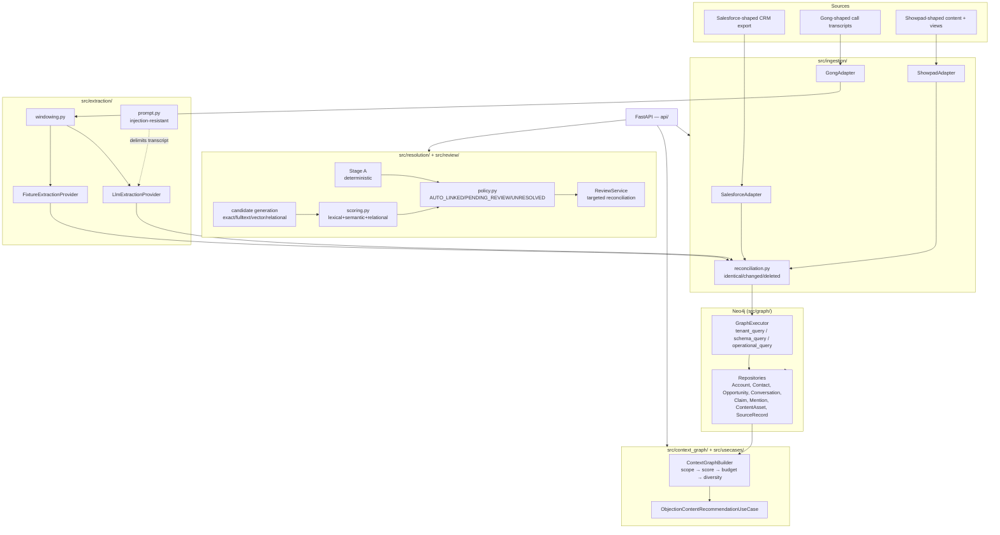

# Sales Context Graph

CRM data (Salesforce-shaped) + sales-call transcripts (Gong-shaped) + content
engagement (Showpad-shaped) → a tenant-isolated Neo4j knowledge graph →
evidence-backed, query-specific context for one sales workflow:

> Given an opportunity, identify the objection raised by a stakeholder in the
> latest relevant call and recommend an appropriate content asset the buyer
> hasn't already viewed, with exact evidence and an explainable
> entity-resolution decision.

## Status

The full P0–P4.5 vertical slice described in [`docs/plan.md`](docs/plan.md) is
implemented and tested, plus MVP cloud-readiness hardening (API-key auth,
durable Redis-backed job store, Fly.io deploy artifacts — see
[`docs/deployment.md`](docs/deployment.md)) and a product-completeness pass:

- **Q&A layer** (`api/routes/qa.py`) — 7 fixed intents (account objections,
  call briefing, open commitments, content recommendation, open conflicts,
  missing stakeholders, what's new since a date) instead of raw
  id-scoped queries only.
- **Content-effectiveness loop** — links which `ContentAsset` was shared,
  because of which objection `Claim`, and whether the deal's stage actually
  moved afterward (`GET /api/v1/opportunities/{id}/content-effectiveness`) —
  the one thing conversation-only tools structurally can't answer.
- **Conflict detection** — two contradicting, coexisting Claims are now
  detected and surfaced (`GET /api/v1/opportunities/{id}/conflicts`), not
  silently dropped.
- **Buying-committee mapping** — flags single-threaded deals
  (`GET /api/v1/opportunities/{id}/buying-committee`), honestly scoped: real
  MEDDIC role classification isn't built (would need an LLM), only who's
  actually on the calls.
- **Cross-deal aggregation** — top objections across one seller's open
  pipeline (`GET /api/v1/sellers/{id}/top-objections`).

226 tests pass (unit, integration against a live Neo4j, security, and eval) —
see the completion report at the end of this document for the phase-by-phase
breakdown, real measured numbers, and known limitations.

## Architecture



Every node carries `workspace_id` (the tenant-isolation boundary); Showpad
nodes additionally carry `division_id`. `GraphExecutor.tenant_query()`
structurally rejects Cypher that doesn't scope a matched node by `workspace_id`
— see [`docs/security-and-tenancy.md`](docs/security-and-tenancy.md).

## Setup

Requires Docker and Python 3.12+ (developed/tested against 3.11.6 — see
"Known limitations" below).

```bash
docker compose up -d neo4j redis
pip install -r requirements.txt
cp .env.example .env
```

`docker-compose.yml`'s `neo4j` service publishes on host ports **7475/7688**,
not Neo4j's defaults (7474/7687) — see the comment in that file for why.
`redis` (added for the durable ingestion job store) is shifted to **6380**
for the same reason.

Every route below `/health`/`/ready` now requires an `X-Api-Key` header
(`docs/security-and-tenancy.md`'s auth section) matching the claimed
workspace's key in `WORKSPACE_API_KEYS` — `.env.example` ships a placeholder
key for `ws-demo`; the curl examples below use it as-is.

## Running the tests

```bash
make test-unit          # no Neo4j required
make test-integration   # brings up neo4j, then runs integration/eval/security suites
make test                # everything
```

## Running the demo

```bash
make demo
```

Runs [`demo_volkswagen.py`](demo_volkswagen.py) end to end: seeds Volkswagen
Group + a Volkswagen Financial Services distractor, resolves a "Volks Wagen"
transcript mention (printing every candidate, each component score, the named
relational signals, the top-1/top-2 margin, and the final decision), then runs
the objection-to-content recommendation use case and prints the recommended
(unviewed) asset with its exact transcript evidence.

## Running the API

```bash
uvicorn api.main:app --reload
```

```bash
# health / readiness — the only routes that don't require X-Api-Key
curl localhost:8000/health
curl localhost:8000/ready

# ingest CRM data (workspace_id comes from the header, never the body — §13)
curl -X POST localhost:8000/api/v1/ingestions/crm \
  -H "X-Workspace-Id: ws-demo" -H "X-Api-Key: replace-with-a-generated-secret" \
  -H "Content-Type: application/json" \
  -d '{"accounts": [{"Id": "001x", "Name": "Acme Corp", "Website": "acme.com", "IsDeleted": false}]}'

# check ingestion status
curl localhost:8000/api/v1/ingestions/<ingestion_id> \
  -H "X-Workspace-Id: ws-demo" -H "X-Api-Key: replace-with-a-generated-secret"

# ingest a transcript (email_to_contact_id/email_to_seller_id are optional —
# omitted here, so every speaker resolves to speaker_role=UNKNOWN; pass them
# to get real BUYER/SELLER resolution, as demo_volkswagen.py does)
curl -X POST localhost:8000/api/v1/ingestions/transcripts \
  -H "X-Workspace-Id: ws-demo" -H "X-Api-Key: replace-with-a-generated-secret" \
  -H "Content-Type: application/json" \
  -d @data/sample/gong_call.json

# list mentions awaiting human review
curl localhost:8000/api/v1/unresolved-mentions \
  -H "X-Workspace-Id: ws-demo" -H "X-Api-Key: replace-with-a-generated-secret"

# resolve one
curl -X POST localhost:8000/api/v1/unresolved-mentions/<mention_id>/resolve \
  -H "X-Workspace-Id: ws-demo" -H "X-Api-Key: replace-with-a-generated-secret" \
  -H "Content-Type: application/json" \
  -d '{"reviewer_id": "reviewer@example.com", "selected_entity_id": "<account_id>"}'

# build a context graph for a subject
curl -X POST localhost:8000/api/v1/context/build \
  -H "X-Workspace-Id: ws-demo" -H "X-Api-Key: replace-with-a-generated-secret" \
  -H "Content-Type: application/json" \
  -d '{"subject_id": "<contact_id>"}'

# fetch a claim's exact evidence
curl localhost:8000/api/v1/claims/<claim_id>/evidence \
  -H "X-Workspace-Id: ws-demo" -H "X-Api-Key: replace-with-a-generated-secret"
```

`replace-with-a-generated-secret` above matches `.env.example`'s placeholder
verbatim — fine for a local `cp .env.example .env` demo; generate a real key
(`python -c "import secrets; print(secrets.token_urlsafe(32))"`) for anything
beyond that. See [`docs/deployment.md`](docs/deployment.md) for Fly.io.

Sample request payloads for every endpoint live under
[`data/sample/`](data/sample/).

## Visualizing the Context Graph

`GET /viz` (open `http://localhost:8000/viz` in a browser once the API is
running) is a small, self-contained debugging page — not part of docs/plan.md's
required API surface — that calls `POST /api/v1/context/build` from the form
inputs (workspace, API key, subject/conversation id, max nodes) and renders
the returned Claims as a subject→predicate→object node-link graph (hand-rolled
force layout, no CDN dependency). Click an edge to fetch that Claim's exact
evidence via `GET /api/v1/claims/{id}/evidence`, shown in the side panel.
Edge color encodes polarity (green=AFFIRMED, red=NEGATED, yellow=HYPOTHETICAL).
The `/viz` route itself has no server-side auth (it's static HTML, no data) —
the access boundary is the API calls it makes, which do require `X-Api-Key`.

## Documentation

- [`docs/architecture.md`](docs/architecture.md) — module layout and data flow
- [`docs/ontology.md`](docs/ontology.md) — the canonical domain model
- [`docs/entity-resolution.md`](docs/entity-resolution.md) — the implemented
  Stage A / candidate-generation / scoring / policy algorithm, with the real
  calibration data behind the thresholds
- [`docs/security-and-tenancy.md`](docs/security-and-tenancy.md) — tenant
  isolation mechanism and what's explicitly *not* production-authorized yet
- [`docs/deployment.md`](docs/deployment.md) — Fly.io deploy topology and
  exact setup commands
- [`docs/evaluation.md`](docs/evaluation.md) — metric definitions and real
  measured results from this repo's own test runs
- [`docs/plan.md`](docs/plan.md) — the original authoritative spec this
  implementation follows

## What's ported from `ai-knowledge-graph-platform`

Eight modules under `src/graph/` were forked from a sibling project (a
different-domain GraphRAG platform) rather than built from scratch, per that
decision's own record — see each file's header comment for provenance. They
are kept working (Increment 1's `tests/unit/graph_legacy/` suite) as generic
tenant-scoped graph infrastructure, but operate on a different node shape
(`Entity`/`Statement`/`tenant`) than this repo's sales-specific model
(`Account`/`Claim`/`workspace_id`) — they are not called by the P1+
repositories built on the new model. See
[`docs/architecture.md`](docs/architecture.md) for the full reuse-vs-rewrite
breakdown per module.

## Known limitations

- **Python version mismatch**: `pyproject.toml` declares `requires-python
  >=3.12`; this repo was developed and tested against the locally available
  3.11.6. No 3.12-only syntax is used, but this hasn't been verified on 3.12
  itself.
- **No real packaging**: imports resolve via `pythonpath = ["."]`
  (`pyproject.toml`) and `PYTHONPATH=/app` (`Dockerfile`), not an installable
  package — a deliberate Increment 1 decision, documented in `src/core/config.py`'s
  header, to avoid packaging-metadata risk before there's a reason to publish
  this as a package.
- **Embedding provider**: local `sentence-transformers` (`all-MiniLM-L6-v2`,
  384-dim, no API key — `src/embedding/`), wired into `resolve_mention()`'s
  semantic scoring. The versioned vector index (`contact_embeddings_v1`) still
  exists structurally but runs unpopulated — `vector_candidates()` (candidate
  *generation* via the index) is a separate, larger milestone (embedding-on-
  write for every Contact, backfill) from semantic *scoring* of already-
  generated candidates, which is what's wired today. See
  `docs/entity-resolution.md` for the real measured calibration
  (`DEFAULT_LEXICAL_WEIGHT=0.97`) this choice drove.
- **Ingestion job store**: durable when `REDIS_URL` is configured
  (`api/state.py::RedisIngestionStore`, backed by Redis — `docker-compose`
  locally, `fly redis create` on Fly). Falls back to an in-process dict
  (`InMemoryIngestionStore`) when it isn't — that fallback does not survive a
  process restart, proven by `tests/unit/api/test_ingestion_store.py`.
- **Auth**: MVP API-key-per-workspace (`X-Api-Key`, checked against
  `WORKSPACE_API_KEYS` — `api/dependencies.py::verify_api_key`), not a real
  identity provider. No self-serve key rotation/revocation, no OAuth/JWT. See
  `docs/security-and-tenancy.md` for exactly what this does and doesn't cover.
- **Conflict detection**: one strategy only (same subject+predicate, differing
  object, both AFFIRMED, neither superseded — `src/resolution/
  conflict_detection.py`). The legacy `contradiction_detector.py`'s other
  strategies all need a hardcoded relation-name vocabulary with no analogue
  for free-text Claim predicates, so they weren't ported.
- **Buying-committee mapping**: only enumerates who's actually on the calls
  and flags single-threaded deals. Real MEDDIC-style role classification
  (Economic Buyer vs. Champion vs. Technical Buyer) isn't built — every
  `StakeholderAssignment.role` is honestly `UNKNOWN`; classifying it would
  need either an LLM or a much larger rule set than this vertical slice
  justifies. See `src/resolution/stakeholder_inference.py`.
- **Temporal queries**: "what's new since \<date\>" is real (filters on
  `Claim.transaction_from`, populated at ingest). True point-in-time ("as of
  \<past date\>") reconstruction is not built — `valid_to`/`transaction_to`
  are never set by anything in this vertical slice, since no supersession-
  closes-the-interval trigger exists. See `docs/evaluation.md`'s Known
  measurement gaps.
- **Cross-deal aggregation**: scoped by `seller_id` (real, exists on every
  Opportunity), not region/territory — no such field exists on
  Account/Opportunity/Seller in this vertical slice.
