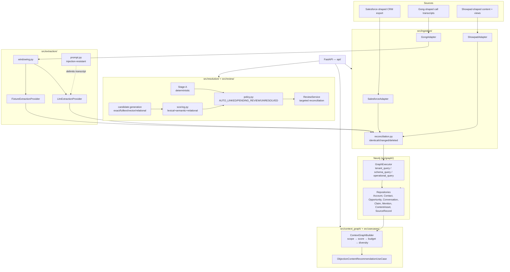

# Sales Context Graph

> **Current release snapshot — 2026-08-11**
>
> A production-oriented, evidence-backed companion layer for Showpad-style
> sales context. The repository is ready for a controlled pilot; a live
> Showpad OAuth/API connector, CRM write-back and enterprise IdP provisioning
> still require external integration contracts.

CRM data (Salesforce-shaped) + sales-call transcripts (Gong-shaped) + content
engagement (Showpad-shaped) → a tenant-isolated Neo4j knowledge graph →
evidence-backed, query-specific context for one sales workflow:

> Given an opportunity, identify the objection raised by a stakeholder in the
> latest relevant call and recommend an appropriate content asset the buyer
> hasn't already viewed, with exact evidence and an explainable
> entity-resolution decision.

## Status

The full P0–P4.5 vertical slice described in [`docs/plan.md`](docs/plan.md) is
implemented and tested, plus MVP cloud-readiness hardening (API-key auth,
durable Redis-backed job store, Fly.io deploy artifacts — see
[`docs/deployment.md`](docs/deployment.md)) and a product-completeness pass:

- **Q&A layer** (`api/routes/qa.py`) — 7 fixed intents (account objections,
  call briefing, open commitments, content recommendation, open conflicts,
  missing stakeholders, what's new since a date) instead of raw
  id-scoped queries only.
- **Content-effectiveness loop** — links which `ContentAsset` was shared,
  because of which objection `Claim`, and whether the deal's stage actually
  moved afterward (`GET /api/v1/opportunities/{id}/content-effectiveness`) —
  the one thing conversation-only tools structurally can't answer.
- **Conflict detection** — two contradicting, coexisting Claims are now
  detected and surfaced (`GET /api/v1/opportunities/{id}/conflicts`), not
  silently dropped.
- **Buying-committee mapping** — flags single-threaded deals
  (`GET /api/v1/opportunities/{id}/buying-committee`) and supports opt-in LLM
  role classification; contacts below the confidence floor remain `UNKNOWN`.
- **Cross-deal aggregation** — top objections across one seller's open
  pipeline (`GET /api/v1/sellers/{id}/top-objections`).

A second pass (Increments 15–20) closed the gaps between "a tested engine" and
"an assistant a seller would actually use":

- **Natural-language questions** — `POST /api/v1/ask` classifies free text
  ("what's new at Volkswagen?") against the closed intent catalog
  (`src/nlq/catalog.py`), resolves company/contact names via the existing
  entity-resolution stack, and dispatches to the real use case — never
  free-text-to-Cypher, and an unresolvable/ambiguous name refuses rather than
  guessing. Requires `LLM_PROVIDER=anthropic` + `LLM_API_KEY`; every LLM-backed
  route returns `503` (not a fabricated answer) when unconfigured.
- **Grounded narrative summaries** — `include_narrative: true` on `/ask`, or
  `POST /api/v1/narrative/summarize`, turns a claim table into a few cited
  sentences. `src/narrative/grounding.py` mechanically verifies every
  `[claim_id]` citation against the claims actually supplied — a hallucinated
  citation rejects the whole summary rather than shipping it.
- **Proactive signals + Slack digest** — `GET /api/v1/digest` /
  `POST /api/v1/digest/deliver` run five rules (single-threaded deal, objection
  with no follow-up content, shared content never opened, unresolved conflict,
  stalled deal) across a workspace's or seller's open pipeline. No in-process
  scheduler — an external cron calls `/deliver` (see `docs/operations.md`).
- **LLM stakeholder role classification** — opt-in (`?classify_roles=true`)
  on the buying-committee endpoints; a contact with no evidence, or a
  below-confidence-floor classification, stays honestly `UNKNOWN`
  (`src/resolution/stakeholder_classification.py`).
- **Conflict resolution + true point-in-time queries** — `POST
  /api/v1/opportunities/{id}/conflicts/{conflict_id}/resolve` picks a winner
  (confidence, then recency, then honestly `undecided`) and closes the
  loser's bitemporal interval, which is what makes `POST /api/v1/qa/as-of`
  ("what did we believe as of \<date\>") a real reconstruction rather than the
  previously-documented gap.
- **Seller-facing surfaces** — `/viz` gained "Ask" and "Alerts" tabs (its
  intent-runner tab is now driven by `GET /api/v1/qa/intents`, not a hardcoded
  list), and `GET /viz/panel?opportunity_id=...` is a compact,
  iframe-embeddable single-deal view for embedding in Salesforce/Showpad — an
  embeddable panel, not a packaged app (no OAuth, no AppExchange packaging).

The repository has a broad unit/integration/security/evaluation suite with
**547 tests collected**. The latest full local run executed all 547 tests and
finished with **547 passed** in 241 seconds; it emitted 28 Windows asyncio
cleanup warnings but no test failures. RAGAS remains an optional
external-judge evaluation
and is not included in the default test count. See the completion report at
the end of this document for the phase-by-phase breakdown, measured numbers
and known limitations. Deferred work is centralized in
[`docs/evaluation.md`](docs/evaluation.md), rather than hidden in code
comments.

## Engineering rigor — the short version

[`docs/evaluation.md`](docs/evaluation.md) is long (it's the actual working
record of every audit pass against this repo, not written for skimming) — if
you only read three things in it:

1. **A real, exploitable tenant-isolation bug, found and fixed.**
   `src/resolution/candidates.py`'s vector search computed its top-K
   *before* the workspace filter ran — one tenant's vectors could crowd out
   another's. Fixed, and proven with a test that fails against the old code
   and passes against the new one:
   [`tests/security/test_vector_candidates_tenant_isolation.py`](tests/security/test_vector_candidates_tenant_isolation.py).
2. **A full external-brief cross-check, including the parts I recommended
   against.** The [Showpad-compatibility analysis](docs/evaluation.md) and
   [external architecture review](docs/evaluation.md) each ran as a real
   audit, not a self-congratulatory pass — see the ⚠ findings and the
   `docs/adr-000*.md` series, which document items built *despite* my own
   recommendation against them, per an explicit stakeholder call to
   implement everything, including the parts flagged premature.
3. **A self-audit against enterprise SaaS rigor, run *after* the fact.**
   [The Showpad engineering-rigor assessment](docs/evaluation.md) turned the
   same scrutiny on this repo's delivery process, security posture, and
   operational maturity — found real gaps (no CI existed until this pass;
   `mypy` was installed and never once run), fixed the cheap high-leverage
   ones for real (CI, rate limiting, GDPR erasure execution, audit logging,
   alerting, JWT/SSO validation code — each with its own tests), and named
   the ones that are genuinely out of reach without your own cloud accounts
   (a live IdP connection, an actual `fly deploy`) rather than faking them.

## Architecture



Every node carries `workspace_id` (the tenant-isolation boundary); Showpad
nodes additionally carry `division_id`. `GraphExecutor.tenant_query()`
structurally rejects Cypher that doesn't scope a matched node by `workspace_id`
— see [`docs/security-and-tenancy.md`](docs/security-and-tenancy.md).

## Setup

Requires Docker and Python 3.11+ (matches `pyproject.toml`'s
`requires-python`; developed/tested against 3.11.6).

```bash
docker compose up -d neo4j redis
pip install -r requirements.lock.txt
cp .env.example .env
```

`docker-compose.yml`'s `neo4j` service publishes on host ports **7475/7688**,
not Neo4j's defaults (7474/7687) — see the comment in that file for why.
`redis` (added for the durable ingestion job store) is shifted to **6380**
for the same reason.

Every tenant-data route requires an `X-Api-Key` header matching the claimed
workspace's key in `WORKSPACE_API_KEYS`. `/health` and `/ready` remain public
for platform probes. Optional production authorization is enabled with
`AUTHZ_ENFORCEMENT_ENABLED=true` and either real SSO or an explicitly trusted
claims gateway; otherwise the service fails closed.

## Running the tests

```bash
make test-unit          # no Neo4j required
make test-integration   # brings up neo4j, then runs integration/eval/security suites
make test                # everything
```

## Running the demo

```bash
make demo
```

Runs [`demo_volkswagen.py`](demo_volkswagen.py) end to end: seeds Volkswagen
Group + a Volkswagen Financial Services distractor, resolves a "Volks Wagen"
transcript mention (printing every candidate, each component score, the named
relational signals, the top-1/top-2 margin, and the final decision), then runs
the objection-to-content recommendation use case and prints the recommended
(unviewed) asset with its exact transcript evidence.

## Running the API

```bash
uvicorn api.main:app --reload
```

```bash
# health / readiness — the only routes that don't require X-Api-Key
curl localhost:8000/health
curl localhost:8000/ready

# ingest CRM data (workspace_id comes from the header, never the body — §13)
curl -X POST localhost:8000/api/v1/ingestions/crm \
  -H "X-Workspace-Id: ws-demo" -H "X-Api-Key: replace-with-a-generated-secret" \
  -H "Content-Type: application/json" \
  -d '{"accounts": [{"Id": "001x", "Name": "Acme Corp", "Website": "acme.com", "IsDeleted": false}]}'

# check ingestion status
curl localhost:8000/api/v1/ingestions/<ingestion_id> \
  -H "X-Workspace-Id: ws-demo" -H "X-Api-Key: replace-with-a-generated-secret"

# ingest a transcript (email_to_contact_id/email_to_seller_id are optional —
# omitted here, so every speaker resolves to speaker_role=UNKNOWN; pass them
# to get real BUYER/SELLER resolution, as demo_volkswagen.py does)
curl -X POST localhost:8000/api/v1/ingestions/transcripts \
  -H "X-Workspace-Id: ws-demo" -H "X-Api-Key: replace-with-a-generated-secret" \
  -H "Content-Type: application/json" \
  -d @data/sample/gong_call.json

# list mentions awaiting human review
curl localhost:8000/api/v1/unresolved-mentions \
  -H "X-Workspace-Id: ws-demo" -H "X-Api-Key: replace-with-a-generated-secret"

# resolve one
curl -X POST localhost:8000/api/v1/unresolved-mentions/<mention_id>/resolve \
  -H "X-Workspace-Id: ws-demo" -H "X-Api-Key: replace-with-a-generated-secret" \
  -H "Content-Type: application/json" \
  -d '{"reviewer_id": "reviewer@example.com", "selected_entity_id": "<account_id>"}'

# build a context graph for a subject
curl -X POST localhost:8000/api/v1/context/build \
  -H "X-Workspace-Id: ws-demo" -H "X-Api-Key: replace-with-a-generated-secret" \
  -H "Content-Type: application/json" \
  -d '{"subject_id": "<contact_id>"}'

# fetch a claim's exact evidence
curl localhost:8000/api/v1/claims/<claim_id>/evidence \
  -H "X-Workspace-Id: ws-demo" -H "X-Api-Key: replace-with-a-generated-secret"
```

`replace-with-a-generated-secret` above matches `.env.example`'s placeholder
verbatim — fine for a local `cp .env.example .env` demo; generate a real key
(`python -c "import secrets; print(secrets.token_urlsafe(32))"`) for anything
beyond that. See [`docs/deployment.md`](docs/deployment.md) for Fly.io.

Sample request payloads for every endpoint live under
[`data/sample/`](data/sample/).

## Visualizing the Context Graph and asking questions

`GET /viz` (open `http://localhost:8000/viz` in a browser once the API is
running) is a small, self-contained debugging page — not part of docs/plan.md's
required API surface — with four tabs:

- **Context Graph**: calls `POST /api/v1/context/build` from the form inputs
  (workspace, API key, subject/conversation id, max nodes) and renders the
  returned Claims as a subject→predicate→object node-link graph (hand-rolled
  force layout, no CDN dependency). Click an edge to fetch that Claim's exact
  evidence via `GET /api/v1/claims/{id}/evidence`, shown in the side panel.
  Edge color encodes polarity (green=AFFIRMED, red=NEGATED, yellow=HYPOTHETICAL).
- **Browse Intents**: a generic runner over every Q&A/insights endpoint
  (`api/routes/qa.py`, `api/routes/insights.py`). Since Increment 20 the
  dropdown is populated from `GET /api/v1/qa/intents`
  (`src/nlq/catalog.py`'s single source of truth) instead of a hardcoded JS
  array — the field list can no longer drift from the real API surface. Pick
  a question, fill in the generated fields, and the JSON response renders as a
  readable nested table (one generic renderer, not one bespoke UI per intent).
- **Ask**: free-text question → `POST /api/v1/ask` (Increment 15/16) — shows
  the resolved intent, confidence, any ambiguities the system refused to guess
  through (an unresolvable company name, an account with two open deals),
  the grounded narrative summary if requested, and the underlying structured
  result. Requires `LLM_PROVIDER`/`LLM_API_KEY` configured server-side;
  otherwise renders the honest `503`.
- **Optional voice output**: `POST /api/v1/tts` accepts grounded answer text
  and returns `audio/mpeg`. Enable it with `TTS_PROVIDER=openai` and
  `TTS_API_KEY`; the Ask response remains text-first, so TTS latency never
  blocks the answer. Keep audio behind an explicit user toggle and retain the
  text fallback if the provider times out.
- **RAGAS evaluation**: the optional `eval` extra provides a version-pinned
  runner for `faithfulness`, `answer_relevancy`, `context_precision`, and
  `context_recall`. Install with `pip install -e ".[eval]"`, set
  `OPENAI_API_KEY`, then run `python scripts/run_ragas.py`. The versioned
  golden set is `data/eval/ragas_golden.jsonl`; results are written to
  `artifacts/ragas/latest.json`. This is an LLM-judge evaluation and does not
  replace deterministic grounding, entity-resolution recall, or load tests.
  Entity-resolution precision/recall can be scored separately from an exported
  prediction file with `python scripts/score_resolution.py --golden
  data/eval/entity_resolution_golden.jsonl --predictions <predictions.jsonl>`.
- **Alerts**: `GET /api/v1/digest` (Increment 17) — the five proactive signals
  across a workspace's or one seller's open pipeline.

Separately, `GET /viz/panel?token=...` is a compact, single-opportunity,
**iframe-embeddable** view (alerts + open objections + buying committee)
meant for embedding in Salesforce/Showpad. This is an embeddable panel, not a
packaged Salesforce/Showpad app — no OAuth flow, no AppExchange packaging.
`token` is a long-lived, workspace+opportunity-scoped panel token, not the
real workspace API key: mint one with `POST /viz/panel-token` (requires
`X-Api-Key`, body `{"opportunity_id": "..."}`) once, out of band, when
configuring the embed, and put only the returned token in the iframe `src` —
the real API key never reaches the browser. See `src/viz/panel_tokens.py` for
the token's format, expiry (`PANEL_TOKEN_TTL_SECONDS`), and how to revoke one
early (bump that workspace's version rather than rotating
`WORKSPACE_API_KEYS`). `EMBED_ALLOWED_ORIGINS` (`.env.example`) separately
sets which origins may iframe the page via `Content-Security-Policy:
frame-ancestors`; empty (the default) denies all embedding.

`GET /viz/panel` itself now requires a valid token (`Depends(verify_panel_token)`)
before it renders anything. `GET /viz` (the full debugging UI, not the
embeddable panel) still has no server-side auth — the access boundary there
is the API calls it makes, which do require `X-Api-Key`.

## Documentation

- [`docs/architecture.md`](docs/architecture.md) — module layout and data flow
- [`docs/ontology.md`](docs/ontology.md) — the canonical domain model
- [`docs/entity-resolution.md`](docs/entity-resolution.md) — the implemented
  Stage A / candidate-generation / scoring / policy algorithm, with the real
  calibration data behind the thresholds
- [`docs/security-and-tenancy.md`](docs/security-and-tenancy.md) — tenant
  isolation mechanism and what's explicitly *not* production-authorized yet
- [`docs/deployment.md`](docs/deployment.md) — Fly.io deploy topology and
  exact setup commands
- [`docs/operations.md`](docs/operations.md) — running the proactive digest
  (why there's no in-process scheduler, and how to trigger it via cron)
- [`docs/evaluation.md`](docs/evaluation.md) — metric definitions and real
  measured results from this repo's own test runs
- [`docs/presentation_script.md`](docs/presentation_script.md) — canonical
  presentation narrative and screen reachability runbook
- [`docs/plan.md`](docs/plan.md) — canonical target/specification document;
  current release status and measured gaps belong in `docs/evaluation.md`
- [`docs/adr-*.md`](docs/) — individual architecture decisions and their
  consequences; do not duplicate them in the README
- [`tasks/lessons.md`](tasks/lessons.md) — project lessons and failure-mode
  patterns, not product architecture or release status

`docs/plan_old.md` is archived historical planning material and is not a
second current specification.

## What's ported from `ai-knowledge-graph-platform`

Eight modules under `src/graph/` were forked from a sibling project (a
different-domain GraphRAG platform) rather than built from scratch, per that
decision's own record — see each file's header comment for provenance. They
are kept working (Increment 1's `tests/unit/graph_legacy/` suite) as generic
tenant-scoped graph infrastructure, but operate on a different node shape
(`Entity`/`Statement`/`tenant`) than this repo's sales-specific model
(`Account`/`Claim`/`workspace_id`) — they are not called by the P1+
repositories built on the new model. See
[`docs/architecture.md`](docs/architecture.md) for the full reuse-vs-rewrite
breakdown per module.

## Known limitations

- **No real packaging**: imports resolve via `pythonpath = ["."]`
  (`pyproject.toml`) and `PYTHONPATH=/app` (`Dockerfile`), not an installable
  package — a deliberate Increment 1 decision, documented in `src/core/config.py`'s
  header, to avoid packaging-metadata risk before there's a reason to publish
  this as a package.
- **Embedding provider**: local `sentence-transformers` (`all-MiniLM-L6-v2`,
  384-dim, no API key — `src/embedding/`), wired into `resolve_mention()`'s
  semantic scoring. The versioned vector index (`contact_embeddings_v1`) is
  executable and tenant-safe, but is not auto-populated by default —
  `vector_candidates()` (candidate *generation* via the index) is a separate
  operator-run backfill from semantic *scoring* of already-
  generated candidates, which is what's wired today. See
  `docs/entity-resolution.md` for the real measured calibration
  (`DEFAULT_LEXICAL_WEIGHT=0.97`) this choice drove. Optional Qdrant cleanup
  is wired into contact erasure, but enabling semantic candidate retrieval at
  production scale still requires a measured embedding backfill and index
  population.
- **Ingestion execution**: durable when `REDIS_URL` and
  `INGESTION_QUEUE_ENABLED=true` are configured. Redis-backed jobs use retries,
  visibility timeout, DLQ handling and bounded worker concurrency. The local
  synchronous path remains available when the flag is false. The job store is
  backed by `api/state.py::RedisIngestionStore` when Redis is configured
  (`docker-compose` locally, `fly redis create` on Fly), and falls back to an
  in-process dict (`InMemoryIngestionStore`) when it is not; that fallback does
  not survive a process restart, proven by
  `tests/unit/api/test_ingestion_store.py`.
- **Auth**: MVP API-key-per-workspace (`X-Api-Key`, checked against
  `WORKSPACE_API_KEYS` — `api/dependencies.py::verify_api_key`) is the
  active auth path on every route; no self-serve key rotation/revocation.
  Optional deny-by-default authorization (`AUTHZ_ENFORCEMENT_ENABLED`) now
  covers opportunity/division scope, ingestion roles and signed panel tokens;
  it fails closed unless SSO or an explicitly trusted claims gateway is
  configured. The pure policy is in `src/auth/policy.py` and route-level deny
  behavior is covered by tests.
  Real OIDC/JWT validation exists (`src/auth/sso.py`, RS256 signature +
  issuer + audience + expiry checks, tested against a locally-signed JWT —
  see `docs/adr-0006-sso-scaffolding.md`) but isn't connected to a live
  identity provider or wired into any route — `SSO_ENABLED` defaults
  `false`. See `docs/security-and-tenancy.md` for exactly what the active
  path does and doesn't cover.
- **Conflict detection**: one detection strategy only (same subject+predicate,
  differing object, both AFFIRMED, neither superseded —
  `src/resolution/conflict_detection.py`). The legacy `contradiction_detector.py`'s
  other strategies all need a hardcoded relation-name vocabulary with no
  analogue for free-text Claim predicates, so they weren't ported. Resolution
  (Increment 19, `src/resolution/conflict_arbitration.py`) is real now — higher
  confidence wins, a confidence tie falls back to recency, and a genuine
  double-tie stays `undecided` (no arbitrary tie-break) rather than being
  forced.
- **Buying-committee mapping**: `single_threaded`/`distinct_buyer_contact_ids`
  come from real enumeration of who's actually on the calls
  (`src/resolution/stakeholder_inference.py`). Role *classification* (Economic
  Buyer vs. Champion vs. Technical Buyer) is now real too, but opt-in
  (`?classify_roles=true`, Increment 18,
  `src/resolution/stakeholder_classification.py`) — off by default so the
  plain DB-only path stays fast and LLM-free. A contact with no evidence, or a
  classification below the confidence floor, stays honestly `UNKNOWN`.
- **Temporal queries**: "what's new since \<date\>" (filters on
  `Claim.transaction_from`) and true point-in-time ("as of \<past date\>")
  reconstruction (`POST /api/v1/qa/as-of`) are both real. The latter is only
  as complete as `valid_to`/`transaction_to` closure — Increment 19 wired that
  closure into `ConflictsUseCase.resolve()`, but a Claim reconciled via
  `ReviewService`'s subject_id-rewrite path (not conflict resolution) still
  doesn't close its interval. See `docs/evaluation.md`'s Known measurement
  gaps for the precise remaining scope.
- **Cross-deal aggregation**: scoped by `seller_id` (real, exists on every
  Opportunity), not region/territory — no such field exists on
  Account/Opportunity/Seller in this vertical slice.
- **LLM vendor**: `src/llm/chat.py` implements both Anthropic (default,
  `LLM_PROVIDER=anthropic`) and OpenAI-backed `ChatFn`s behind the same
  `Callable[[str], Awaitable[str]]` protocol `LlmExtractionProvider` has
  used since P3. `src/llm/gateway.py` adds an optional fallback from the
  primary to a secondary provider on transient/availability errors only
  (never masking a validation failure) — off by default
  (`LLM_FALLBACK_ENABLED=false`), see `docs/adr-0005-llm-gateway-fallback.md`.
- **No in-process scheduler**: proactive digest delivery
  (`POST /api/v1/digest/deliver`) is triggered by an external cron, not a
  timer this process runs itself. Ingestion has a separate durable worker
  process when enabled; digest scheduling remains external to avoid duplicate
  runs during web-process scaling. See `docs/operations.md`.
