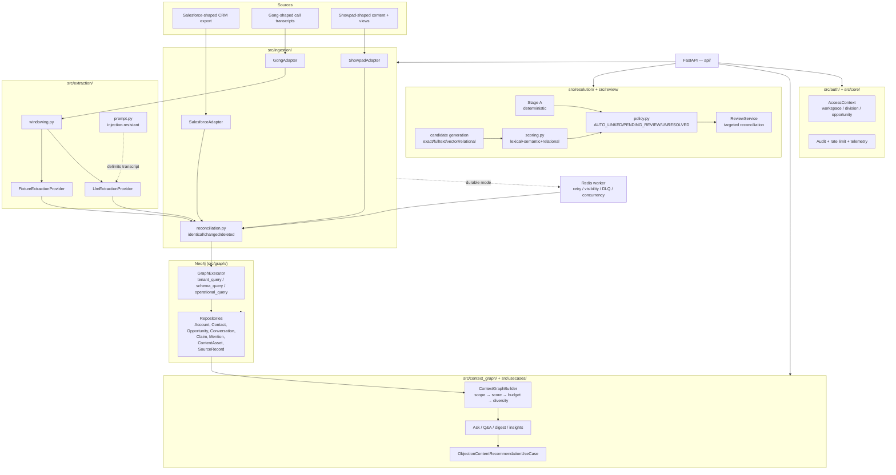

# Architecture

This document describes what's actually implemented, module by module. For the
spec this follows, see [`plan.md`](plan.md). For the entity-resolution
algorithm specifically, see [`entity-resolution.md`](entity-resolution.md).

## Layering

```
api/                  FastAPI routes — thin: parse request, call a pipeline/
                       use case/service, shape the response. No business logic.
src/domain/           Pure Pydantic v2 contracts + deterministic ID hashing.
                       No I/O, no Neo4j import anywhere in this package.
src/ingestion/        Source adapters (Salesforce/Gong/Showpad-shaped) +
                       reconciliation (identical/changed/deleted) + pipelines
                       that wire adapters to repositories.
src/extraction/       Transcript windowing + the extraction provider Protocol,
                       a deterministic fixture implementation, and a real
                       LLM-backed implementation behind the same interface.
src/resolution/       Stage A deterministic rules, candidate generation,
                       scoring, decision policy — all pure except candidate
                       generation, which is the only piece that queries Neo4j.
src/review/           Async human-review service (§9) — reviewer resolves a
                       PENDING_REVIEW Mention, targeted Claim reconciliation.
src/context_graph/    Bounded, scored Claim selection for one scope.
src/usecases/         Q&A, Ask, narrative, digest, conflict, committee,
                      temporal and objection-to-unviewed-content use cases.
src/graph/            Neo4j: tenant-safe execution modes, schema/indexes,
                      migrations, and one repository per aggregate.
src/auth/              Pure authorization policy and OIDC/JWKS validation.
src/core/             Settings, rate limiting, telemetry, caching and clients.
```

Dependency direction is one-way: `api` depends on everything below it;
`src/domain` depends on nothing in this repo.

## Data flow

A larger, styled version of this diagram — with Claim anatomy, the tenant
isolation model, and the dependency stack — is in
[`architecture.html`](architecture.html) (open it directly in a browser).



Every node carries `workspace_id` (the tenant-isolation boundary); Showpad
nodes additionally carry `division_id`. `GraphExecutor.tenant_query()`
structurally rejects Cypher that doesn't scope a matched node by
`workspace_id` — see [`security-and-tenancy.md`](security-and-tenancy.md).
README keeps a deliberately simplified product overview; this document is the
canonical technical diagram and includes governance and durable worker paths.

1. **Ingest.** An adapter parses one raw external record into a `(domain
   entity, external_id, object_type, content_hash)` tuple
   (`src/ingestion/adapters/base.py::ParsedRecord`).
   `src/ingestion/reconciliation.py` decides CREATED / NO_OP / SUPERSEDED /
   TOMBSTONED against the entity's `SourceRecord`/`SourceSnapshot` history,
   using the pure state-transition functions in `src/domain/versioning.py`.
   Only on CREATED/SUPERSEDED does the pipeline write the entity via a
   repository.
2. **Extract** (transcripts only). Segments are persisted unconditionally,
   before any extraction runs. `src/extraction/windowing.py` groups segments
   into overlapping windows; a provider (`FixtureExtractionProvider` or
   `LlmExtractionProvider`, same `ExtractionProvider` Protocol) returns typed
   assertions per window. The pipeline turns each assertion into a `Claim`
   whose `claim_id` is `assertion_id(...)` — content-derived, so re-extracting
   the same sentence from two overlapping windows collapses to one node via
   `ClaimRepository.create_claim`'s `MERGE`.
3. **Resolve** (entity mentions). `src/resolution/pipeline.py::resolve_mention`
   tries Stage A (deterministic, unique-match-only) first; on failure it
   generates candidates, scores them, and applies the decision policy. Ties
   into `src/review/service.py` for the human-review half of the loop.
4. **Serve.** `src/context_graph/builder.py` fetches Claims for a scope, scores
   by confidence/recency/adjudication, greedily selects under a node/token
   budget with a per-predicate diversity cap.
   `src/usecases/objection_content_recommendation.py` layers the specific
   6-step recommendation logic (§12) on top of the repository layer directly
   (it doesn't route through the generic builder, since its ranking criterion
   — curated tag match — isn't the builder's general relevance/recency/
   adjudication scoring).

## Tenant safety

Every repository method builds its Cypher via `src/graph/execution.py`'s
`scoped_match()` and calls `GraphExecutor.tenant_query()`, which structurally
rejects any query that doesn't scope a matched node by `workspace_id` — either
as a `{workspace_id: $workspace_id}` property-map (the repository-layer
convention) or an explicit `x.workspace_id = $workspace_id` WHERE-equality (the
form full-text/vector procedure calls need, since `CALL db.index.*.queryNodes`
has no property-map MATCH pattern to scope at all). See
[`security-and-tenancy.md`](security-and-tenancy.md).

## Ported modules (`src/graph/*.py`, 8 files)

`alias_registry.py`, `bitemporal.py`, `contradiction_detector.py` +
`contradiction_strategies.py`, `domain_ontology.py`, `ontology_registry.py`,
`review_queue.py`, `reification.py` were forked from a sibling project
(`ai-knowledge-graph-platform`, a different-domain GraphRAG platform) rather
than built from scratch. Each carries a provenance comment. They:

- import a generic `Entity`/`Statement`/`RELATES_TO` graph shape keyed by a
  bare `tenant: str`, not this repo's `workspace_id`/typed-label model;
- are kept working (`tests/unit/graph_legacy/`) as legacy infrastructure, but
  are **not called by any P1+ repository** — `bitemporal.py`'s and
  `reification.py`'s query patterns are useful references (valid-time+
  transaction-time WHERE clauses; the reified-triple pattern) but would need
  a rewrite, not a parameter rename, to operate on `Claim`/`Account` nodes;
- `review_queue.py` and `alias_registry.py` specifically do **not** satisfy P4
  as-is — `src/review/service.py` and `src/resolution/*.py` are fresh
  implementations against the P0 model; see `src/review/service.py`'s module
  docstring for the itemized reasons (single-candidate shape, no
  `workspace_id`, in-memory dict with no tenant scoping).

Fork infrastructure they still depend on: `src/core/config.py` (trimmed —
dropped every field with no analog here), `src/core/retry.py` (verbatim),
`src/core/neo4j_client.py` (a ~90-line slice of the original 1553-line file —
only `__init__`/`run`/`close`/`get_neo4j`, not the RAG-ingestion schema-init
machinery nothing here calls), `src/graph/ontology_migration.py` (verbatim),
`src/graph/inference_engine.py` (only the `InferenceRule` dataclass — the full
`ForwardChainingEngine` isn't forked since nothing in this slice needs
Datalog-style KG completion inference).

## API layer

FastAPI routes are intentionally thin — see `api/routes/*.py`. Workspace
isolation is structural in repository queries. Optional production
authorization is enforced by `src/auth/policy.py`: middleware covers
opportunity path routes, while body-scoped Ask, Context, Q&A and ingestion
routes validate `AccessContext` after Pydantic parsing. The signed panel token
path becomes a narrow opportunity-scoped context.

Ingestion supports two explicit modes. With `INGESTION_QUEUE_ENABLED=false`,
the API executes the pipeline synchronously for local development. With it
enabled, the API writes an accepted job and enqueues it to Redis; the separate
`src.ingestion.worker` process claims jobs into per-slot processing lists,
retries transient failures, reaps stale claims and writes poison jobs to the
DLQ. Both modes preserve the same `IngestionState` and HTTP contract.
