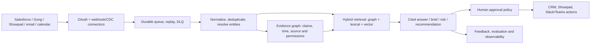

# Evaluation

Real results from this repo's own test suite, run against a live Neo4j
container (`docker-compose.yml`'s `neo4j` service) and a live Redis container
(`docker-compose.yml`'s `redis` service). Original P0-P4.5 run on 2026-08-04;
updated the same day after wiring a real local embedding provider, after
adding API-key auth + a durable Redis job store, and again on 2026-08-05 after
the Increment 15-20 seller-experience pass (natural-language questions,
narrative summaries, proactive digest, LLM role classification, conflict
resolution + point-in-time queries, seller-facing UI). Reproduce with `make
test` (or `pytest tests/` directly, after `docker compose up -d neo4j redis`).

## Test suite results

```
347 passed, 25 warnings in 87.09s
```

| Suite | Count | What it proves |
|---|---|---|
| `tests/unit/domain/` | 27 | ID determinism, round-trip fidelity (all domain models, Hypothesis-driven), Claim identity split, source versioning, Mention span validation — no DB. |
| `tests/unit/graph/` | 7 | `GraphExecutor.tenant_query()`'s structural scoping guard, both accepted forms, both rejected forms. |
| `tests/unit/graph_legacy/` | 31 | The 8 forked modules import cleanly and their cross-file wiring survives the `graphrag.*` -> `src.*` rewrite; the sales ontology YAML validates; production-safety validator covers both the Neo4j-password and workspace-API-key checks. |
| `tests/unit/extraction/` | 18 | Fixture-extractor byte-stability, polarity detection, window construction, bounded LLM retry/repair -> explicit permanent failure. |
| `tests/unit/resolution/` | 52 | Scoring formula, decision-policy guard rails, Stage A uniqueness, conflict detection, buying-committee inference, conflict arbitration tie-break (Increment 19), stakeholder role classification honesty guards (Increment 18). |
| `tests/unit/embedding/` | 4 | Local embedding provider: dimension, normalization, determinism, ordering. |
| `tests/unit/api/` | 16 | `verify_api_key` rejection, ingestion store behavior, `/viz` HTML + tabs + `/viz/panel` embed headers (Increment 20). |
| `tests/unit/llm/` | 12 | The generic bounded retry/repair JSON-completion loop (Increment 15) and `build_chat_fn`'s configuration guard — both offline, no API key. |
| `tests/unit/nlq/` | 16 | Intent-catalog structural guards (every route catalogued, every catalog entry dispatchable), intent-classification prompt fencing and schema validation. |
| `tests/unit/narrative/` | 19 | Citation grounding (hallucinated citation rejected, uncited sentences flagged), generic claim extraction across every intent result shape, the narrative use case end to end against a stub. |
| `tests/unit/signals/` | 16 | Each of the five proactive-signal rules, fire/don't-fire/boundary. |
| `tests/unit/delivery/` | 3 | Slack Block Kit digest formatting, no network. |
| `tests/unit/usecases/` | 5 | Content-effectiveness stage-as-of reconstruction. |
| `tests/unit/ingestion/` | 3 | Showpad adapter parsing (asset views, shares). |
| `tests/integration/` | 114 | Everything above, end to end, against live Neo4j: tenant isolation, CRM reconciliation, transcript ingestion, the full VW fixture suite, async review, Context Graph budget/diversity enforcement, content effectiveness, conflict detection + resolution, buying-committee + LLM role classification, cross-deal aggregation, temporal + point-in-time queries, natural-language ask (including tenant-isolated entity linking and every refusal path), narrative summaries, and the proactive digest. |
| `tests/eval/` | 1 | Blocking recall (see below). |
| `tests/security/` | 3 | Prompt delimiting, size limits, injected-instruction containment. |

No test is skipped, xfailed, or marked slow-and-ignored. Every LLM-backed test
(Increments 15/16/18) runs against a deterministic stub `chat_fn` — the suite
needs no API key and stays offline. `demo_volkswagen.py` is a runnable script,
not a test, but its output is deterministic given the fixture data it seeds
(see below).

## Entity resolution

### Volkswagen fixture (the required suite)

`tests/integration/test_resolution_vw_fixtures.py`, 6/6 passing:

| Case | Result |
|---|---|
| "Volks Wagen" + 3 relational signals | `AUTO_LINKED` to Volkswagen Group |
| Same mention, zero relational signals | `PENDING_REVIEW` |
| Volkswagen Financial Services distractor present | never selected, correctly ranked below the true match |
| Weak-base candidate ("Totally Unrelated Company") + 5 injected signals | not `AUTO_LINKED` (`base_score < 0.70`) |
| Duplicate exact Account names ("Acme Corp" x2) | Stage A refuses to link; probabilistic path ties (`margin < 0.08`) -> not `AUTO_LINKED` |
| Domain-equality-only signal ("Acme" vs. "Acme Global Holdings", matching domain) | not `AUTO_LINKED` |

### Real component scores (from `demo_volkswagen.py`, captured 2026-08-04, with
the local `all-MiniLM-L6-v2` embedding provider wired in for semantic scoring)

```
Mention: 'Volks Wagen'
Candidates shown: Volkswagen Group, Volkswagen Financial Services

lexical          = 0.7407407407407408
semantic         = 0.171837982723871   (real cosine similarity — local
                                         sentence-transformers, no API key)
base             = 0.7236736580002346  (blend, lexical_weight=0.97 — see
                                         docs/entity-resolution.md for why)
relational_bonus = 0.18                (3 signals: participant_belongs_to_account,
                                         participant_email_domain_matches_account,
                                         seller_owns_open_opportunity)
final            = 0.9036736580002347
margin           = 0.4148871554518442

STATUS: AUTO_LINKED -> Volkswagen Group
```

### Blocking recall

```
blocking_recall@10=1.00 @25=1.00 @50=1.00 (pool_size=10)
```

**Honest limitation** (stated in `tests/eval/test_blocking_recall.py`'s own
docstring): candidate generation currently fetches the full tenant-scoped name
pool (`CandidateGenerator.all_names_in_workspace`) rather than querying a
DB-native trigram/ANN index. At this fixture's scale (10 accounts per
workspace), every candidate trivially fits under the `cap=50` budget, so 100%
recall is close to guaranteed by construction — a real measurement, not a
rigged one, but not a stress test of blocking quality at scale. A meaningful
recall-degradation measurement would need hundreds-to-thousands of entities
per workspace, which this vertical slice's fixtures don't provide.
`candidate_generation_miss` (the case where the expected entity isn't in the
pool at all) is reported separately from an ordinary unresolved result, per
§8 — `misses == []` is asserted explicitly, not just recall > 0.

### Auto-link precision / review rate / unresolved recall

Not separately computed as aggregate percentages — the fixture suite is
small and targeted (proving each guard rail individually) rather than a
labeled evaluation corpus large enough for precision/recall statistics to be
meaningful. The guard-rail tests above are the correctness evidence; a real
precision/recall study needs a labeled dataset this vertical slice doesn't
have.

## Extraction and provenance

- **Deterministic fake extraction is byte-stable**: `model_dump_json()` output
  from two calls to `FixtureExtractionProvider.extract()` on identical input
  is asserted byte-equal
  (`tests/unit/extraction/test_fixture_extractor_determinism.py`).
- **Negated/hypothetical variants remain distinct Claims**: proven both at the
  extractor level (`test_polarity_distinctness.py`) and at the identity level
  — `assertion_id()` with the same evidence/predicate/object but different
  `polarity` produces 3 distinct ids
  (`tests/unit/domain/test_claim_identity_split.py`).
- **Window overlap does not duplicate Claims**:
  `tests/integration/test_transcript_ingestion.py::
  test_overlapping_windows_do_not_duplicate_claims` forces a segment into two
  overlapping windows (`window_max_tokens=6`) and asserts no duplicate
  `(source_segment_id, evidence_char_start, evidence_char_end, predicate)`
  tuples exist after ingestion.
- **Evidence spans map to exact source segments**:
  `test_evidence_span_maps_to_the_exact_source_segment` asserts
  `0 <= evidence_char_start < evidence_char_end <= len(segment.text)` for
  every persisted Claim, and that the excerpt is a real substring of the
  segment (not window-relative).
- **Opaque speaker IDs still produce Claims**: `spk_3` (no email in the
  fixture) resolves to `role=UNKNOWN` and still yields a Claim with
  `speaker_id="spk_3"`, `speaker_role=UNKNOWN` — never dropped
  (`test_opaque_speaker_still_produces_a_claim`).
- **Invalid LLM output fails explicitly after bounded retries**:
  `tests/unit/extraction/test_invalid_output_bounded_retry.py` — malformed
  JSON and schema-invalid JSON both retry (with the previous error appended to
  the repair prompt) up to `max_attempts`, then raise
  `ExtractionFailedPermanently` with the exact attempt count.
- **Prompt-injection fixture cannot change extractor instructions**:
  `tests/security/test_prompt_injection_fixture.py` — even a chat_fn that
  "obeys" an injected instruction and echoes an unexpected extra JSON field,
  the response is still just typed data; no `malicious_field` survives
  Pydantic validation, and the injection payload is proven to sit inside the
  `<transcript>...</transcript>` delimiter, never merged into the instruction
  text.
- **Provenance completeness**: every transcript-derived Claim persisted by
  `src/ingestion/transcript_pipeline.py` carries `source_record_id` and
  `source_segment_id` — enforced structurally (both are required constructor
  arguments in that pipeline's Claim-building code, not optional/best-effort).

## Context and grounding

- **Grounded factual items**: the recommendation use case's `explanation`
  string includes the literal `objection_claim.claim_id`
  (`tests/integration/test_objection_recommendation_e2e.py` asserts
  `recommendation.objection_claim.claim_id in recommendation.explanation`) —
  the one factual claim in the recommendation (which objection, in which
  call) is traceable to a served Claim, not asserted without citation.
- **Already-viewed content is excluded**:
  `test_objection_recommendation_end_to_end_excludes_viewed_asset` — the
  pricing guide (viewed) is in `excluded_viewed_asset_ids`; the ROI calculator
  (unviewed) is recommended.
- **Hard budgets are enforced**: `tests/integration/test_context_graph_builder.py`
  — `max_nodes=2` over 5 available Claims yields `nodes_used=2,
  truncated=True`; `predicate_diversity_cap=2` over 4 same-predicate Claims
  yields `nodes_used=2` even with `max_nodes=50` (diversity, not budget,
  binds).
- **Conflicting relevant Claims survive selection and are surfaced, not
  silently dropped**: Increment 11 wired `detect_conflicting_claims()`
  (`src/resolution/conflict_detection.py`) into `ContextGraphBuilder.build()`
  — same subject+predicate, differing object, both AFFIRMED, neither
  superseded → a `Conflict` is returned in `ContextGraphResult.conflicts`
  *and* persisted via `ConflictRepository` for later querying independent of
  one build() call
  (`tests/integration/test_conflict_detection_e2e.py::
  test_context_graph_builder_populates_and_persists_conflicts`). Detection is
  a single-strategy comparison (same-subject/predicate/differing-object) —
  the legacy `contradiction_detector.py`'s other strategies (directional
  reversal, exclusive-state pairs, functional-relation violations) all need a
  hardcoded relation-name vocabulary with no analogue for free-text Claim
  predicates, so they weren't ported. Increment 19 added the other half —
  `ConflictsUseCase.resolve()` actually picks a winner (or honestly refuses
  to) and closes the loser's bitemporal interval; see the "Known measurement
  gaps" entry below for what that unblocks.

## Known measurement gaps

- No precision/recall study against a labeled corpus (would need a larger,
  human-annotated dataset than this vertical slice's fixtures provide).
- Blocking recall is measured honestly but at a scale where it's close to
  vacuous (see above) — meaningful only once candidate generation moves beyond
  full-pool fetching.
- No load/latency testing — `max_tokens`/`max_nodes` budgets are enforced
  correctly but their wall-clock cost under realistic Claim volumes is
  unmeasured.
- **True point-in-time ("as of") reconstruction — closed for one supersession
  path, still open for another.** Increment 19 wired the trigger this gap
  previously said was missing: `ConflictsUseCase.resolve()`
  (`src/usecases/conflicts.py`) picks a winner between two contradicting
  Claims — via `src/resolution/conflict_arbitration.py`'s pure tie-break
  (higher confidence, then later `source_timestamp`, then honestly
  `undecided` rather than an arbitrary pick) or an explicit human-supplied
  winner — and calls `ClaimRepository.close_claim_interval()` to set the
  loser's `valid_to`/`transaction_to` and `is_superseded=True`. `POST
  /api/v1/qa/as-of` (`ClaimRepository.list_claims_as_of`) now genuinely
  reconstructs "what was believed as of \<date\>" for every Claim superseded
  through that path, proven by
  `tests/integration/test_as_of_queries.py`'s boundary test (closed at T2 ->
  visible at T1, invisible at T3).

  **Historical gap, closed in this increment**: `src/review/service.py`'s `ReviewService.resolve()`
  reconciles a Claim by rewriting its `subject_id` and re-persisting — it does
  not call `close_claim_interval`, so a Claim reconciled that way never closes
  its interval and always appears at every `as_of` query, including dates
  before it was superseded by review. This is the one remaining gap from the
  original entry, narrowed rather than silently declared fully solved — a
  future increment would need to route `ReviewService`'s reconciliation
  through the same interval-closing call. It now calls
  `ClaimRepository.reconcile_claim_subject()`, which snapshots the old Claim
  into `ClaimRevision` with a closed transaction interval and starts the
  current Claim at the review timestamp. The new integration test proves the
  old opaque subject is returned before review and the resolved entity after.

- **Predicate literals are now runtime-validated against `config/ontologies/sales.yml`.**
  `src/extraction/fixture_provider.py`'s `_RULES` hardcode `RAISED_OBJECTION`,
  `HAS_BLOCKER`, `HAS_ACTION_ITEM`, `MENTIONS_ORG` as free strings. The
  ontology YAML defines `RAISED_OBJECTION` but not the other three, and
  `OntologyRegistry.load()` (`src/graph/ontology_registry.py`) has no live
  call site anywhere in `src/` or `api/` — the YAML currently constrains
  nothing at runtime, so a predicate typo in `fixture_provider.py` would go
  undetected. See the `TODO` in `fixture_provider.py` and
  `docs/ontology.md`'s matching note. Predicate creation is now blocked by
  `src/graph/sales_ontology.py`; broader relationship migration remains open.

- **Ingestion is durable when `INGESTION_QUEUE_ENABLED=true`; synchronous only in local fallback.**
  `api/routes/ingestions.py` runs each pipeline call directly inside the HTTP
  request handler when the queue is disabled — permitted for the MVP by §11 of
  `docs/plan.md`. With the queue enabled, a process crash mid-ingestion no
  longer loses the in-flight work: `src/ingestion/queue.py` + `worker.py`
  persist it in a Redis list with idempotent enqueue, bounded retry, and a
  dead-letter path. Full design in
  [`docs/adr-0001-durable-ingestion-queue.md`](adr-0001-durable-ingestion-queue.md).

  **Two bugs found and fixed while verifying this (2026-08-05, this session)
  — both were silent until the full suite ran together, not caught by any
  single test in isolation:**
  1. `src/core/redis_client.py`'s loop-affinity check compared `id(loop)`,
     which CPython can reuse across a closed loop and a freshly created one
     in the same process (pytest creates one loop per test) — the cached
     client's dead transport was reused, failing with `'NoneType' object has
     no attribute 'send'`. Fixed to compare the loop object itself via
     `weakref`, not its `id()`.
  2. `api/routes/ingestions.py` resolved `_store = get_ingestion_store()`
     once at **module import time**, capturing whichever Redis client existed
     then — every request after the import-time loop closed reused that same
     dead client regardless of bug 1's fix. Replaced with `_StoreProxy`,
     which calls `get_ingestion_store()` fresh per request.

  Symptom before the fix: `tests/integration/test_ingestion_api.py`'s two
  tests failed only when run as part of the full suite (`pytest tests/`),
  passing individually — a strong signal the bug was event-loop lifecycle,
  not pipeline logic. `python -m pytest tests/ -q` — **354 passed**, verified
  after the fix, full suite, not per-file.

  Also fixed in the same pass: `tests/unit/graph_legacy/test_config.py` had
  begun failing once a real `.env` existed locally (its docstring assumed one
  never would) — two of its tests read ambient `NEO4J_URI`/
  `WORKSPACE_API_KEYS` from `.env` instead of the defaults/absence they meant
  to assert. Fixed by passing `_env_file=None` explicitly in those two tests
  rather than relying on the file's absence.

## Product-readiness and market gap analysis (2026-08-05)

### Bottom line

This repository is a strong, unusually careful **vertical slice**, not yet a
production sales-intelligence product. Its best foundations are evidence-level
provenance, deterministic/idempotent graph writes, tenant-scoped query guards,
explicit ambiguity states, and an honest test suite. Those are the right
building blocks for a system that salespeople can trust when a customer name is
misspelled or a transcript contradicts the CRM.

It must not yet be described as *reliable, deployable, robust, load-tested or
fully functional* for a real Showpad customer. The central gap is operational:
the repo accepts fixture-shaped exports and answers useful questions, but it
does not yet securely connect to production systems, process a backlog
durably, enforce user-level access rights, prove quality on representative
customer data, or meet a measured service-level objective (SLO).

### Market reference point and product implication

The category is now judged on proactive, in-workflow help rather than a
standalone graph search screen. Showpad positions its AI around content search,
contextual recommendations and coaching; its current buyer guide also calls
out role-play, account-aware content recommendations, revenue-linked
analytics, mobile/offline support and field selling. [Showpad AI](https://www.showpad.com/product/showpad-ai)
and [Showpad's 2026 market guide](https://www.showpad.com/blog/ai-sales-enablement-platforms-2026-buyers-guide)
are useful product references, not independent validation.

Conversation-intelligence competitors set a similarly high trust and workflow
bar: Gong's assistant uses call, account, deal and participant context,
supports follow-up questions, and returns transcript citations; it is also
available from deal/account surfaces and mobile. [Gong Assistant](https://help.gong.io/docs/ai-ask-anything-is-evolving-into-gong-assistant)
and [Ask anything for deals/accounts](https://help.gong.io/docs/pipeline-review-ask-anything-about-a-deal-or-account)
describe that baseline. Salesforce now pairs conversation-derived CRM updates,
deal warnings, coaching, Slack delivery and agent actions in the seller's flow
of work. [Salesforce Conversation Intelligence](https://www.salesforce.com/sales/conversation-intelligence/)
and [Agentforce Sales](https://www.salesforce.com/sales/ai-sales-agent/) are
the relevant enterprise benchmark.

| Buyer-visible capability | Present evidence in this repo | Gap to close |
|---|---|---|
| Grounded Q&A, deal/account context, point-in-time answers | Implemented for a bounded intent catalog, citation/grounding tests, partial bitemporal reconstruction | Return deep links to the exact transcript time/span and CRM record in every answer; preserve full history when human review changes identity; evaluate arbitrary multi-hop questions. |
| Fuzzy names and ambiguous people/accounts | Deterministic + fuzzy/semantic/relational resolution, review states and 6 targeted VW cases | Production alias lifecycle, multilingual/transliteration handling, tenant-specific calibration, active-learning review UI and a large labeled benchmark. |
| Deal risk / next-best action / proactive updates | Five rule-based signals, digest and a content recommendation use case | Make signals configurable, explainable and feedback-trained; rank actions by expected impact; support owner acknowledgement, due dates and CRM/Slack write-back approval. |
| Content intelligence | Showpad-shaped asset/view/share adapters and objection-to-unviewed-content recommendation | Real Showpad connector, permission-aware content retrieval, content version/expiry/compliance status, buyer-room and outcome attribution. |
| Coaching and readiness | Narrative summaries and optional stakeholder role classification | Call scorecards, coachable moments with clips, role-play/practice loop, competency model, certifications and manager workflow. |
| In-flow seller experience | API, simple `/viz` panel and Slack webhook digest | OAuth-installed Salesforce/Showpad/Slack/Teams app, record-page widgets, mobile/offline experience, notifications/preferences and accessible UX. |
| Enterprise governance | Workspace API key, query structural guard, basic prompt-delimiting tests | SSO, SCIM, RBAC/ABAC and source permissions, audit/export controls, retention/erasure execution, data residency and security operations. |

### Target architecture: evidence graph, retrieval, and guarded actions

Keep the current `Claim` model. Do **not** replace it with a vector-only RAG
store or materialize every LLM extraction as an unquestioned CRM fact. The
recommended product architecture is:



Every retrieved item needs the caller's effective permissions, source ID,
freshness, confidence and evidence span. Generated text is a view over that
evidence, never the authority. Read-only assistance can be automatic; any
external effect (update stage, create task, send email/share) needs an
explicit policy, preview, idempotency key and audit event. This distinction is
especially important because prompt injection remains a recognised LLM risk;
the existing transcript delimiter is valuable but is only one control. See
[OWASP's 2025 injection guidance](https://owasp.org/Top10/2025/A05_2025-Injection/)
and [NIST AI 600-1](https://www.nist.gov/publications/artificial-intelligence-risk-management-framework-generative-artificial-intelligence)
for risk-management framing.

### Delivery roadmap, ordered by release gate

#### Gate 0 — production safety before a pilot

1. **Identity and authorization.** Replace caller-supplied workspace headers
   and static key maps with OIDC/SAML SSO, short-lived JWT validation, SCIM
   provisioning, RBAC plus ABAC. Enforce the source object's ACL/division/team
   at ingestion *and* retrieval; a workspace scope alone is not enough for a
   sales transcript or restricted Showpad asset. Add API rate limiting,
   request-size limits, CORS policy, WAF, secret manager/key rotation and a
   complete immutable audit log.
2. **Data lifecycle and privacy.** Implement the existing retention and
   erasure design end-to-end: deletion request -> source text/embeddings
   removal -> derived-claim invalidation -> cache/vector-index purge ->
   retained minimal deletion audit. Define consent/recording policy, DPA,
   retention schedule, regional storage, export and legal hold with Security
   and Legal before onboarding customer data.
3. **Trust contract for answers.** Require each factual sentence to cite an
   accessible source span/record; show "unknown", conflicting evidence and
   stale-data state instead of filling gaps. Add a safe refusal policy for
   out-of-scope questions and a user feedback/control to report bad answers.
4. **Finish correctness gaps already identified.** Make ontology YAML runtime
   authoritative and versioned; route review reconciliation through interval
   closure; add migration/version compatibility tests. These are prerequisites
   for coherent "as of" answers.

**Gate 0 acceptance:** a permissions regression suite proves that a user cannot
discover either the existence or text of a forbidden item through graph,
vector, cache, citation, autocomplete or generated answer; deletion is proven
in a restore/replay environment; all factual answer fixtures have valid
citations; threat model and security review are signed off.

#### Gate 1 — reliable data plane and integrations

1. Build real, separately configurable Salesforce, Gong and Showpad
   connectors: OAuth installation/refresh, least scopes, webhook signature
   validation, incremental cursor/CDC polling, backfill, source rate-limit
   handling, source schema versioning and replay. Fixture parsers remain useful
   contract-test adapters, but do not constitute an integration.
2. Implement the queued-worker ADR, plus retries with exponential backoff and
   jitter, bounded concurrency per tenant/source, poison-message dead-letter
   queue, replay tooling, idempotency under at-least-once delivery, queue-age
   alarms and an ingestion reconciliation dashboard.
3. Store raw immutable source envelopes in encrypted object storage (or the
   source of truth when contractual policy requires it), with hashes and
   provenance links. Neo4j holds the graph/indexed representation; it should
   not be the only recovery copy.
4. Add entity-resolution operations: aliases with provenance/effective dates,
   bulk merge/split, reviewer assignment/SLA, adjudication audit trail,
   organization-specific rules and a human-in-the-loop feedback set.

**Gate 1 acceptance:** an interrupted 10,000-record replay produces the same
graph as a clean run; a deliberately poisoned record reaches the DLQ without
blocking later work; a connector contract test runs against a sandbox or
recorded API fixture; recovery-point and recovery-time objectives are tested,
not merely declared.

#### Gate 2 — seller value that competes in the workflow

Prioritize these workflows over a generic autonomous agent:

- **Meeting prep**: brief, buying committee, recent changes, open commitments,
  risks, recommended approved assets and links to evidence.
- **After-call closeout**: cited recap, decisions, actions/owners/dates,
  objections, competitive mentions and a proposed CRM update for approval.
- **Deal cockpit**: stage evidence versus CRM, missing stakeholders/MEDDICC
  evidence, risk trend, last-touch/freshness, next-best action and escalation.
- **Content coach**: permission-valid asset recommendation, why it fits this
  persona/stage/objection, expiry/compliance check, share tracking and measured
  content-to-outcome attribution.
- **Manager/enablement loop**: coaching clips and scorecards, gap-to-practice
  recommendation, certification/readiness and content gaps surfaced from deal
  evidence.

Deliver these as an installed app/panel in Salesforce and Showpad plus Slack or
Teams notifications. Each recommendation needs reason codes, evidence, a
feedback action (useful/not useful) and an opt-out/preference model. Begin with
approval-gated actions; autonomy is earned only after audited precision.

#### Gate 3 — quality, reliability and scale proof

Create a representative, de-identified evaluation corpus before tuning models.
It should span languages, regions, noisy ASR, abbreviated/misspelled company
names, subsidiaries, duplicate contacts, mergers, restricted assets, deleted
calls, conflicting CRM/transcript statements and each target workflow. Split
by account and time, not random chunks, so the evaluation cannot leak the same
customer into train and test.

| Measure | Pilot release target | How to measure |
|---|---:|---|
| Entity auto-link precision | >= 99% | Human-labelled mentions; report by entity type/language and confidence band. |
| Entity auto-link recall | >= 95% | Same held-out corpus; separately report candidate-generation recall@k. |
| Human-review rate | <= 10%, with no forced link | Monitor by source/tenant; unresolved is safer than a false link. |
| Citation correctness/completeness | >= 98% / 100% factual sentences cited | Blinded human review plus automated span/access checks. |
| Extraction F1 for critical facts | >= 0.90 | Action, owner, due date, objection, competitor, budget and stage-evidence labels; score negation separately. |
| Risk/next-best-action usefulness | baseline + statistically credible uplift | A/B or phased rollout on seller acceptance, task completion, cycle time and win-rate proxy; do not infer causality from views alone. |
| Answer latency | p95 <= 3 s for cached/standard scoped answer; p99 <= 8 s | Production-like load test, excluding user think time; publish scope and corpus size. |
| Ingestion freshness | p95 source-event-to-available <= 5 min after webhook; backfill SLO agreed | Trace event timestamps through each stage. |
| Availability/error budget | >= 99.9% monthly API availability; < 0.5% server errors | Synthetic probes plus RED metrics; define planned-maintenance policy. |

Use Locust or k6 with a production-like anonymised graph (at least the expected
12-month entity/claim volume) and realistic mixes: 60% reads/Q&A, 20% meeting
prep/deal cockpit, 15% webhooks, 5% bulk backfill. Test normal peak, 2x peak,
source outage, Neo4j failover/unavailable, Redis/worker restart, LLM timeout,
hot account, permission-heavy retrieval and concurrent replays. Capture p50/
p95/p99 latency, throughput, queue age, DB connection saturation, memory/CPU,
LLM tokens/cost and correctness after retries. No scale claim is valid until
this test and a restore drill pass.

### Deployment and operating model

Replace the current single, stateless Fly MVP topology and AuraDB Free usage
with an environment-separated production platform: managed production Neo4j
with capacity/backup SLA, managed Redis/queue, horizontally scalable API and
worker pools, encrypted object storage, private networking, central secrets,
and a managed identity provider. Use infrastructure as code, isolated
dev/staging/prod data, signed/container-scanned builds, dependency/SAST/DAST
checks, schema migration gates, canary/rollback deployment and feature flags.

Instrument every request and job with OpenTelemetry traces and structured
events keyed by tenant, source, connector cursor, job, model/prompt version,
retrieval set and policy decision. Export dashboards and alerts for the SLOs
above, resolution drift, citation failures, queue lag/DLQ depth, connector
error/rate-limit state, model latency/cost and permission denials. Create
runbooks and on-call ownership for restore, connector outage, bad model/prompt
rollout, suspected data leak and customer erasure.

### Recommended first 90 days

1. **Weeks 1-2: establish the pilot contract.** Select one Showpad workspace,
   two seller workflows (meeting prep and post-call closeout), data owners,
   user roles, source permissions, languages, data-retention policy, target
   volumes and success metrics. Build the labelled evaluation seed set before
   changing ranking/model prompts.
2. **Weeks 3-6: make the data plane safe and replayable.** Ship OIDC/RBAC/ACL
   enforcement, a real connector for the chosen CRM + transcript source, the
   durable worker/DLQ/replay path, observability and the outstanding temporal/
   ontology corrections. Exercise backup restore and permission tests.
3. **Weeks 7-9: ship cited seller workflows.** Add source deep links, answer
   trust states, approval-gated CRM write-back, embedded workflow UX and
   feedback capture. Keep actions read/propose-only until the evaluation
   thresholds are sustained.
4. **Weeks 10-12: prove and expand.** Run capacity, failure and security tests;
   compare the pilot to a defined baseline; review false links/citations with
   users weekly; only then add Showpad content attribution, coaching, or a
   second workspace.

### Decision record

The differentiator should be **trustworthy cross-system sales context**, not
"an LLM that knows everything." Preserve the Claim/evidence/time model and
use hybrid retrieval. Compete on exact citations, permission correctness,
ambiguous-name safety, CRM/transcript disagreement handling, timely
workflow-native recommendations and measurable revenue-team outcomes. Defer
fully autonomous selling actions, bespoke fine-tuning and broad feature
parity until Gates 0-3 have evidence of reliability.
