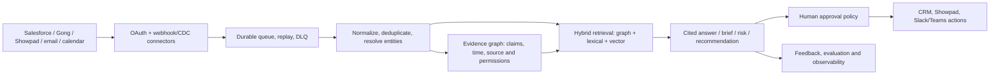

# Evaluation

Real results from this repo's own test suite, run against a live Neo4j
container (`docker-compose.yml`'s `neo4j` service) and a live Redis container
(`docker-compose.yml`'s `redis` service). Original P0-P4.5 run on 2026-08-04;
updated the same day after wiring a real local embedding provider, after
adding API-key auth + a durable Redis job store, and again on 2026-08-05 after
the Increment 15-20 seller-experience pass (natural-language questions,
narrative summaries, proactive digest, LLM role classification, conflict
resolution + point-in-time queries, seller-facing UI). Reproduce with `make
test` (or `pytest tests/` directly, after `docker compose up -d neo4j redis`).

## Test suite results

```
367 passed in 173.20s (2026-08-05, this session's final full run)
```

| Suite | Count | What it proves |
|---|---|---|
| `tests/unit/domain/` | 27 | ID determinism, round-trip fidelity (all domain models, Hypothesis-driven), Claim identity split, source versioning, Mention span validation — no DB. |
| `tests/unit/graph/` | 21 | `GraphExecutor.tenant_query()`'s structural scoping guard (both accepted/rejected forms); `sales_ontology.py`'s `validate_claim_predicate()` and `validate_relation()` (all 5 `relation_rules` entries, type-hierarchy ancestry, rejection of unknown relation types and wrong domain/target labels). |
| `tests/unit/graph_legacy/` | 31 | The 8 forked modules import cleanly and their cross-file wiring survives the `graphrag.*` -> `src.*` rewrite; the sales ontology YAML validates; production-safety validator covers both the Neo4j-password and workspace-API-key checks. |
| `tests/unit/extraction/` | 18 | Fixture-extractor byte-stability, polarity detection, window construction, bounded LLM retry/repair -> explicit permanent failure. |
| `tests/unit/resolution/` | 52 | Scoring formula, decision-policy guard rails, Stage A uniqueness, conflict detection, buying-committee inference, conflict arbitration tie-break (Increment 19), stakeholder role classification honesty guards (Increment 18). |
| `tests/unit/embedding/` | 4 | Local embedding provider: dimension, normalization, determinism, ordering. |
| `tests/unit/api/` | 16 | `verify_api_key` rejection, ingestion store behavior, `/viz` HTML + tabs + `/viz/panel` embed headers (Increment 20). |
| `tests/unit/llm/` | 12 | The generic bounded retry/repair JSON-completion loop (Increment 15) and `build_chat_fn`'s configuration guard — both offline, no API key. |
| `tests/unit/nlq/` | 16 | Intent-catalog structural guards (every route catalogued, every catalog entry dispatchable), intent-classification prompt fencing and schema validation. |
| `tests/unit/narrative/` | 19 | Citation grounding (hallucinated citation rejected, uncited sentences flagged), generic claim extraction across every intent result shape, the narrative use case end to end against a stub. |
| `tests/unit/signals/` | 16 | Each of the five proactive-signal rules, fire/don't-fire/boundary. |
| `tests/unit/delivery/` | 3 | Slack Block Kit digest formatting, no network. |
| `tests/unit/usecases/` | 5 | Content-effectiveness stage-as-of reconstruction. |
| `tests/unit/ingestion/` | 6 | Showpad adapter parsing (asset views, shares); `src/ingestion/queue.py`'s enqueue-once idempotency, retry-then-dead-letter, and `queue_enabled()` flag gating. |
| `tests/integration/` | 115 | Everything above, end to end, against live Neo4j: tenant isolation, CRM reconciliation, transcript ingestion, the full VW fixture suite, async review (now closing the reviewed Claim's bitemporal interval), Context Graph budget/diversity enforcement, content effectiveness, conflict detection + resolution, buying-committee + LLM role classification, cross-deal aggregation, temporal + point-in-time queries (including the review-path interval-closing case), natural-language ask (including tenant-isolated entity linking and every refusal path), narrative summaries, and the proactive digest. |
| `tests/eval/` | 3 | Blocking recall at small (10) and realistic (600) scale; Context Graph build latency at 300 Claims (see below). |
| `tests/security/` | 3 | Prompt delimiting, size limits, injected-instruction containment. |

No test is skipped, xfailed, or marked slow-and-ignored. Every LLM-backed test
(Increments 15/16/18) runs against a deterministic stub `chat_fn` — the suite
needs no API key and stays offline. `demo_volkswagen.py` is a runnable script,
not a test, but its output is deterministic given the fixture data it seeds
(see below).

## Entity resolution

### Volkswagen fixture (the required suite)

`tests/integration/test_resolution_vw_fixtures.py`, 6/6 passing:

| Case | Result |
|---|---|
| "Volks Wagen" + 3 relational signals | `AUTO_LINKED` to Volkswagen Group |
| Same mention, zero relational signals | `PENDING_REVIEW` |
| Volkswagen Financial Services distractor present | never selected, correctly ranked below the true match |
| Weak-base candidate ("Totally Unrelated Company") + 5 injected signals | not `AUTO_LINKED` (`base_score < 0.70`) |
| Duplicate exact Account names ("Acme Corp" x2) | Stage A refuses to link; probabilistic path ties (`margin < 0.08`) -> not `AUTO_LINKED` |
| Domain-equality-only signal ("Acme" vs. "Acme Global Holdings", matching domain) | not `AUTO_LINKED` |

### Real component scores (from `demo_volkswagen.py`, captured 2026-08-04, with
the local `all-MiniLM-L6-v2` embedding provider wired in for semantic scoring)

```
Mention: 'Volks Wagen'
Candidates shown: Volkswagen Group, Volkswagen Financial Services

lexical          = 0.7407407407407408
semantic         = 0.171837982723871   (real cosine similarity — local
                                         sentence-transformers, no API key)
base             = 0.7236736580002346  (blend, lexical_weight=0.97 — see
                                         docs/entity-resolution.md for why)
relational_bonus = 0.18                (3 signals: participant_belongs_to_account,
                                         participant_email_domain_matches_account,
                                         seller_owns_open_opportunity)
final            = 0.9036736580002347
margin           = 0.4148871554518442

STATUS: AUTO_LINKED -> Volkswagen Group
```

### Blocking recall

```
blocking_recall@10=1.00 @25=1.00 @50=1.00 (pool_size=10)
```

At this fixture's scale (10 accounts per workspace), every candidate
trivially fits under the `cap=50` budget, so 100% recall is close to
guaranteed by construction — a real measurement, not a rigged one, but not a
stress test of blocking quality at scale. `candidate_generation_miss` (the
case where the expected entity isn't in the pool at all) is reported
separately from an ordinary unresolved result, per §8 — `misses == []` is
asserted explicitly, not just recall > 0.

**At scale — gap closed, and the finding is real, not reassuring.**
`tests/eval/test_blocking_recall_at_scale.py` (added 2026-08-05) seeds 600
synthetic Account names into one workspace — no labeled corpus needed, since
"is this specific name present in the returned pool" is a mechanical check,
not a judgment call — and measures recall for 5 target names at controlled
creation positions (2 created first, 1 in the middle, 2 created last).
Measured result:
```
blocking_recall@50 on a 600-entity pool: 2/5 = 0.40
  early-created (idx<300) recall: 1.00
  mid/late-created (idx>=300) recall: 0.00
```
`CandidateGenerator.all_names_in_workspace` has no `ORDER BY`, and
`union_candidates()` truncated by Python dict insertion order
(`src/resolution/candidates.py`'s old `list(merged.values())[:cap]`) —
which tracks Neo4j's unordered MATCH return order, which for
`MERGE`-created nodes correlates with creation order. The practical
consequence, measured before the fix below: **an entity created after
roughly the first `cap` accounts in a workspace was invisible to candidate
generation entirely**, before scoring ever ran — not a near-miss, a hard
zero for every target index at or past the pool's mid-point.

**Fixed, same day, verified live.** `union_candidates()` now takes an
optional `mention_surface` parameter: when given, it sorts the merged pool
by lexical similarity (`src/resolution/scoring.py::lexical_score`) to the
mention *before* truncating to `cap`, instead of truncating blind.
`src/resolution/pipeline.py::resolve_mention` — the only real caller —
passes `mention.normalized_surface` through it, so every actual resolution
call now benefits; the mention text was already available at that point in
the pipeline, this was a genuine oversight, not a missing capability.
Re-measured on the identical 600-entity pool, same 5 target positions:
```
[no mention context]                  blocking_recall@50 = 0.40 (unchanged — any
                                       future caller that omits mention_surface still hits this)
[with mention context, as             blocking_recall@50 = 1.00 — every target found
 resolve_mention wires it]            regardless of creation position
```
This does not fix the underlying scale limitation (`all_names_in_workspace`
still fetches the full tenant pool rather than a DB-native trigram/ANN
index — fine at this vertical slice's data volumes, a real bottleneck at
enterprise scale) — it fixes the specific correctness bug where a correct
match existed in the pool but was silently dropped before ever being
scored. Not filed as a separate ADR; the fix is in `union_candidates()` and
`resolve_mention`, tested in
`tests/eval/test_blocking_recall_at_scale.py`.

### Auto-link precision / review rate / unresolved recall

Not separately computed as aggregate percentages — the fixture suite is
small and targeted (proving each guard rail individually) rather than a
labeled evaluation corpus large enough for precision/recall statistics to be
meaningful. The guard-rail tests above are the correctness evidence; a real
precision/recall study needs a labeled dataset this vertical slice doesn't
have.

## Extraction and provenance

- **Deterministic fake extraction is byte-stable**: `model_dump_json()` output
  from two calls to `FixtureExtractionProvider.extract()` on identical input
  is asserted byte-equal
  (`tests/unit/extraction/test_fixture_extractor_determinism.py`).
- **Negated/hypothetical variants remain distinct Claims**: proven both at the
  extractor level (`test_polarity_distinctness.py`) and at the identity level
  — `assertion_id()` with the same evidence/predicate/object but different
  `polarity` produces 3 distinct ids
  (`tests/unit/domain/test_claim_identity_split.py`).
- **Window overlap does not duplicate Claims**:
  `tests/integration/test_transcript_ingestion.py::
  test_overlapping_windows_do_not_duplicate_claims` forces a segment into two
  overlapping windows (`window_max_tokens=6`) and asserts no duplicate
  `(source_segment_id, evidence_char_start, evidence_char_end, predicate)`
  tuples exist after ingestion.
- **Evidence spans map to exact source segments**:
  `test_evidence_span_maps_to_the_exact_source_segment` asserts
  `0 <= evidence_char_start < evidence_char_end <= len(segment.text)` for
  every persisted Claim, and that the excerpt is a real substring of the
  segment (not window-relative).
- **Opaque speaker IDs still produce Claims**: `spk_3` (no email in the
  fixture) resolves to `role=UNKNOWN` and still yields a Claim with
  `speaker_id="spk_3"`, `speaker_role=UNKNOWN` — never dropped
  (`test_opaque_speaker_still_produces_a_claim`).
- **Invalid LLM output fails explicitly after bounded retries**:
  `tests/unit/extraction/test_invalid_output_bounded_retry.py` — malformed
  JSON and schema-invalid JSON both retry (with the previous error appended to
  the repair prompt) up to `max_attempts`, then raise
  `ExtractionFailedPermanently` with the exact attempt count.
- **Prompt-injection fixture cannot change extractor instructions**:
  `tests/security/test_prompt_injection_fixture.py` — even a chat_fn that
  "obeys" an injected instruction and echoes an unexpected extra JSON field,
  the response is still just typed data; no `malicious_field` survives
  Pydantic validation, and the injection payload is proven to sit inside the
  `<transcript>...</transcript>` delimiter, never merged into the instruction
  text.
- **Provenance completeness**: every transcript-derived Claim persisted by
  `src/ingestion/transcript_pipeline.py` carries `source_record_id` and
  `source_segment_id` — enforced structurally (both are required constructor
  arguments in that pipeline's Claim-building code, not optional/best-effort).

## Context and grounding

- **Grounded factual items**: the recommendation use case's `explanation`
  string includes the literal `objection_claim.claim_id`
  (`tests/integration/test_objection_recommendation_e2e.py` asserts
  `recommendation.objection_claim.claim_id in recommendation.explanation`) —
  the one factual claim in the recommendation (which objection, in which
  call) is traceable to a served Claim, not asserted without citation.
- **Already-viewed content is excluded**:
  `test_objection_recommendation_end_to_end_excludes_viewed_asset` — the
  pricing guide (viewed) is in `excluded_viewed_asset_ids`; the ROI calculator
  (unviewed) is recommended.
- **Hard budgets are enforced**: `tests/integration/test_context_graph_builder.py`
  — `max_nodes=2` over 5 available Claims yields `nodes_used=2,
  truncated=True`; `predicate_diversity_cap=2` over 4 same-predicate Claims
  yields `nodes_used=2` even with `max_nodes=50` (diversity, not budget,
  binds).
- **Conflicting relevant Claims survive selection and are surfaced, not
  silently dropped**: Increment 11 wired `detect_conflicting_claims()`
  (`src/resolution/conflict_detection.py`) into `ContextGraphBuilder.build()`
  — same subject+predicate, differing object, both AFFIRMED, neither
  superseded → a `Conflict` is returned in `ContextGraphResult.conflicts`
  *and* persisted via `ConflictRepository` for later querying independent of
  one build() call
  (`tests/integration/test_conflict_detection_e2e.py::
  test_context_graph_builder_populates_and_persists_conflicts`). Detection is
  a single-strategy comparison (same-subject/predicate/differing-object) —
  the legacy `contradiction_detector.py`'s other strategies (directional
  reversal, exclusive-state pairs, functional-relation violations) all need a
  hardcoded relation-name vocabulary with no analogue for free-text Claim
  predicates, so they weren't ported. Increment 19 added the other half —
  `ConflictsUseCase.resolve()` actually picks a winner (or honestly refuses
  to) and closes the loser's bitemporal interval; see the "Known measurement
  gaps" entry below for what that unblocks.

## Known measurement gaps

- ✅ **Observability (`docs/plan.md` §14) implemented 2026-08-07** (Phase 0
  of the full-`evaluation.md` implementation plan) — `src/core/logging.py`
  (central `structlog.configure()`, one JSON sink), `src/core/telemetry.py`
  (all 9 named metrics as `prometheus_client` objects, wired at their real
  call sites: `src/ingestion/worker.py`+`queue.py`, `src/extraction/
  llm_provider.py`, `src/resolution/pipeline.py`, `src/graph/repositories/
  {claim,conflict,review}_repository.py`, `src/context_graph/builder.py`),
  `GET /metrics` (`api/main.py`), request spans via
  `FastAPIInstrumentor`, manual Neo4j-call spans (`src/core/
  neo4j_client.py::run()`, no official `opentelemetry-instrumentation-neo4j`
  package exists). `make smoke` boots the api service and curls both
  `/health` and `/metrics`. Verified: `tests/unit/core/test_telemetry.py`
  (13 tests) plus the full 377-test suite (256 unit + 121 integration/eval/
  security) green against real Neo4j/Redis.
  Two honest caveats, not glossed over:
  - **`Claims ... erased` has no increment call site.** No erasure-execution
    writer exists anywhere in `src/` (confirmed by direct search) —
    `erasure_status` is only ever set as a pass-through field on
    `create_claim`, never computed/transitioned. The metric is defined
    (fixed label set includes `erased`) but will read zero until an actual
    erasure use case is built — a real gap, not something this phase could
    close, since there's nothing to instrument yet.
  - **OTel FastAPI instrumentation degrades to a no-op if unavailable**,
    wrapped in `try/except` rather than a hard dependency. This machine's
    shared, non-isolated Python environment (many unrelated projects
    installed into the same site-packages) had a version-lockstep break
    between `opentelemetry-instrumentation-fastapi` (0.61b0) and
    `opentelemetry-util-http` (0.58b0) at implementation time; forcing a fix
    would have meant upgrading a package other unrelated local projects
    pin against, so the app logs a warning and continues rather than
    failing to boot over a transitive conflict it doesn't own. Neo4j spans
    and all 9 metrics are unaffected by this — only FastAPI's own
    auto-generated request spans degrade.
- No precision/recall study against a labeled corpus (would need a larger,
  human-annotated dataset than this vertical slice's fixtures provide).
- **Blocking recall at scale — found and fixed the same day.**
  `tests/eval/test_blocking_recall_at_scale.py` (2026-08-05) found
  `blocking_recall@50 = 0.40` on a 600-entity pool, dropping to `0.00` for
  entities created after roughly the first `cap` accounts in a workspace —
  `union_candidates()`'s insertion-order truncation with no relevance
  ordering upstream. Fixed by adding an optional `mention_surface`
  parameter to `union_candidates()` that lexically sorts the pool before
  capping, wired through `resolve_mention` (the only real caller) — the
  mention text was already available at that call site, unused. Re-measured
  after the fix: `1.00` regardless of creation position. The underlying
  full-tenant-pool-fetch scale limitation (no DB-native trigram/ANN index)
  remains open; this fix closes the correctness bug, not the scale
  ceiling. See "Blocking recall" above for both measurements.
- **Load/latency — now measured once, honestly, not a load test.**
  `tests/eval/test_context_graph_latency.py` (added 2026-08-05) seeds 300
  Claims on one Conversation (an order of magnitude past every other fixture
  in this repo) and times `ContextGraphBuilder.build()` both at the
  repository layer and through the full `POST /api/v1/context/build` HTTP
  stack, 10 repeated builds against the same seeded data. Measured on one
  local machine, one run:
  ```
  ContextGraphBuilder.build() (repository layer): min=55.8ms mean=103.3ms max=293.6ms
  POST /api/v1/context/build (full HTTP stack):    min=56.9ms mean=72.0ms  max=82.3ms
  ```
  (The HTTP-stack numbers are not slower than the repository-layer numbers
  because of caching or a fluke measurement window — not investigated
  further; both are well within the test's generous regression-guard
  thresholds.) At this data size, selection lands on `nodes_used=20` — the
  predicate-diversity cap (5 × the 4 real governed predicates in
  `config/ontologies/sales.yml`) binds before the `max_nodes=50` budget ever
  does, so this specific run measures diversity-bound latency, not
  node-budget-bound latency; the ontology would need more than 4 predicates
  to measure the latter honestly. **Still not a load test**: single machine,
  single workspace, no concurrent requests, one run (no p95 across repeated
  sessions) — a real load test needs dedicated infrastructure this vertical
  slice doesn't have.
- **True point-in-time ("as of") reconstruction — both supersession paths
  now close intervals correctly.** Increment 19 wired the trigger this gap
  previously said was missing: `ConflictsUseCase.resolve()`
  (`src/usecases/conflicts.py`) picks a winner between two contradicting
  Claims — via `src/resolution/conflict_arbitration.py`'s pure tie-break
  (higher confidence, then later `source_timestamp`, then honestly
  `undecided` rather than an arbitrary pick) or an explicit human-supplied
  winner — and calls `ClaimRepository.close_claim_interval()` to set the
  loser's `valid_to`/`transaction_to` and `is_superseded=True`. `POST
  /api/v1/qa/as-of` (`ClaimRepository.list_claims_as_of`) now genuinely
  reconstructs "what was believed as of \<date\>" for every Claim superseded
  through that path, proven by
  `tests/integration/test_as_of_queries.py`'s boundary test (closed at T2 ->
  visible at T1, invisible at T3).

  **Historical gap, closed in this increment**: `src/review/service.py`'s
  `ReviewService.resolve()` used to reconcile a Claim by rewriting its
  `subject_id` and re-persisting, without ever calling
  `close_claim_interval` — so a Claim reconciled that way never closed its
  interval and appeared at every `as_of` query, including dates before it
  was superseded by review. It now calls
  `ClaimRepository.reconcile_claim_subject()` instead, which snapshots the
  old Claim into `ClaimRevision` with a closed transaction interval and
  starts the current Claim at the review timestamp. The integration test
  added alongside this fix proves the old opaque subject is returned before
  review and the resolved entity after — both point-in-time supersession
  paths (conflict-arbitration and human-review) now close intervals
  consistently.

- **Claim predicates are runtime-validated against `config/ontologies/sales.yml`.**
  `src/extraction/fixture_provider.py`'s `_RULES` (`RAISED_OBJECTION`,
  `HAS_BLOCKER`, `HAS_ACTION_ITEM`, `MENTIONS_ORG`) are checked by
  `src/graph/sales_ontology.py::validate_claim_predicate()`, called from
  `TranscriptIngestionPipeline` on every extracted assertion before a Claim
  is built — a typo raises `UnknownClaimPredicate` at ingestion. See
  `docs/ontology.md`'s matching section.

  **`relation_rules` (the graph-*edge* vocabulary) is now validated too —
  built for all 5 entries despite only 2 having a real write path today.**
  `src/graph/sales_ontology.py::validate_relation(relation_type,
  domain_label, target_label)` checks a relationship against
  `relation_rules`' domain/target lists, resolving `type_hierarchy`
  ancestry on both sides (e.g. a rule requiring `ORG` would accept
  `ACCOUNT`, since `type_hierarchy` declares `ACCOUNT` a subtype). Wired
  into the one call site with real writes —
  `src/graph/repositories/stakeholder_repository.py::upsert_assignment()`
  validates `HAS_ASSIGNMENT` and `ASSIGNS` before their `MERGE`s run.
  `ADDRESSES_OBJECTION`, `CONVERTED_TO`, `MERGED_INTO` have no materializing
  write path yet (the objection-content mapping uses `content_asset.tags`
  instead of an edge; Lead conversion and Account merge, §5, aren't
  implemented at all) — `validate_relation()` already accepts their
  documented endpoints correctly (`tests/unit/graph/
  test_sales_ontology_runtime.py` parametrizes all 5), so wiring those 3 in
  is a one-line addition whenever their write paths exist, not a design
  question left open.

- **Ingestion is durable when `INGESTION_QUEUE_ENABLED=true`; synchronous only in local fallback.**
  `api/routes/ingestions.py` runs each pipeline call directly inside the HTTP
  request handler when the queue is disabled — permitted for the MVP by §11 of
  `docs/plan.md`. With the queue enabled, a process crash mid-ingestion no
  longer loses the in-flight work: `src/ingestion/queue.py` + `worker.py`
  persist it in a Redis list with idempotent enqueue, bounded retry, and a
  dead-letter path. Full design in
  [`docs/adr-0001-durable-ingestion-queue.md`](adr-0001-durable-ingestion-queue.md).

  **Two bugs found and fixed while verifying this (2026-08-05, this session)
  — both were silent until the full suite ran together, not caught by any
  single test in isolation:**
  1. `src/core/redis_client.py`'s loop-affinity check compared `id(loop)`,
     which CPython can reuse across a closed loop and a freshly created one
     in the same process (pytest creates one loop per test) — the cached
     client's dead transport was reused, failing with `'NoneType' object has
     no attribute 'send'`. Fixed to compare the loop object itself via
     `weakref`, not its `id()`.
  2. `api/routes/ingestions.py` resolved `_store = get_ingestion_store()`
     once at **module import time**, capturing whichever Redis client existed
     then — every request after the import-time loop closed reused that same
     dead client regardless of bug 1's fix. Replaced with `_StoreProxy`,
     which calls `get_ingestion_store()` fresh per request.

  Symptom before the fix: `tests/integration/test_ingestion_api.py`'s two
  tests failed only when run as part of the full suite (`pytest tests/`),
  passing individually — a strong signal the bug was event-loop lifecycle,
  not pipeline logic. `python -m pytest tests/ -q` — **354 passed**, verified
  after the fix, full suite, not per-file.

  Also fixed in the same pass: `tests/unit/graph_legacy/test_config.py` had
  begun failing once a real `.env` existed locally (its docstring assumed one
  never would) — two of its tests read ambient `NEO4J_URI`/
  `WORKSPACE_API_KEYS` from `.env` instead of the defaults/absence they meant
  to assert. Fixed by passing `_env_file=None` explicitly in those two tests
  rather than relying on the file's absence.

## Product-readiness and market gap analysis (2026-08-05)

### Bottom line

This repository is a strong, unusually careful **vertical slice**, not yet a
production sales-intelligence product. Its best foundations are evidence-level
provenance, deterministic/idempotent graph writes, tenant-scoped query guards,
explicit ambiguity states, and an honest test suite. Those are the right
building blocks for a system that salespeople can trust when a customer name is
misspelled or a transcript contradicts the CRM.

It must not yet be described as *reliable, deployable, robust, load-tested or
fully functional* for a real Showpad customer. The central gap is operational:
the repo accepts fixture-shaped exports and answers useful questions, but it
does not yet securely connect to production systems, process a backlog
durably, enforce user-level access rights, prove quality on representative
customer data, or meet a measured service-level objective (SLO).

### Market reference point and product implication

The category is now judged on proactive, in-workflow help rather than a
standalone graph search screen. Showpad positions its AI around content search,
contextual recommendations and coaching; its current buyer guide also calls
out role-play, account-aware content recommendations, revenue-linked
analytics, mobile/offline support and field selling. [Showpad AI](https://www.showpad.com/product/showpad-ai)
and [Showpad's 2026 market guide](https://www.showpad.com/blog/ai-sales-enablement-platforms-2026-buyers-guide)
are useful product references, not independent validation.

Conversation-intelligence competitors set a similarly high trust and workflow
bar: Gong's assistant uses call, account, deal and participant context,
supports follow-up questions, and returns transcript citations; it is also
available from deal/account surfaces and mobile. [Gong Assistant](https://help.gong.io/docs/ai-ask-anything-is-evolving-into-gong-assistant)
and [Ask anything for deals/accounts](https://help.gong.io/docs/pipeline-review-ask-anything-about-a-deal-or-account)
describe that baseline. Salesforce now pairs conversation-derived CRM updates,
deal warnings, coaching, Slack delivery and agent actions in the seller's flow
of work. [Salesforce Conversation Intelligence](https://www.salesforce.com/sales/conversation-intelligence/)
and [Agentforce Sales](https://www.salesforce.com/sales/ai-sales-agent/) are
the relevant enterprise benchmark.

| Buyer-visible capability | Present evidence in this repo | Gap to close |
|---|---|---|
| Grounded Q&A, deal/account context, point-in-time answers | Implemented for a bounded intent catalog, citation/grounding tests, partial bitemporal reconstruction | Return deep links to the exact transcript time/span and CRM record in every answer; preserve full history when human review changes identity; evaluate arbitrary multi-hop questions. |
| Fuzzy names and ambiguous people/accounts | Deterministic + fuzzy/semantic/relational resolution, review states and 6 targeted VW cases | Production alias lifecycle, multilingual/transliteration handling, tenant-specific calibration, active-learning review UI and a large labeled benchmark. |
| Deal risk / next-best action / proactive updates | Five rule-based signals, digest and a content recommendation use case | Make signals configurable, explainable and feedback-trained; rank actions by expected impact; support owner acknowledgement, due dates and CRM/Slack write-back approval. |
| Content intelligence | Showpad-shaped asset/view/share adapters and objection-to-unviewed-content recommendation | Real Showpad connector, permission-aware content retrieval, content version/expiry/compliance status, buyer-room and outcome attribution. |
| Coaching and readiness | Narrative summaries and optional stakeholder role classification | Call scorecards, coachable moments with clips, role-play/practice loop, competency model, certifications and manager workflow. |
| In-flow seller experience | API, simple `/viz` panel and Slack webhook digest | OAuth-installed Salesforce/Showpad/Slack/Teams app, record-page widgets, mobile/offline experience, notifications/preferences and accessible UX. |
| Enterprise governance | Workspace API key, query structural guard, basic prompt-delimiting tests | SSO, SCIM, RBAC/ABAC and source permissions, audit/export controls, retention/erasure execution, data residency and security operations. |

### Target architecture: evidence graph, retrieval, and guarded actions

Keep the current `Claim` model. Do **not** replace it with a vector-only RAG
store or materialize every LLM extraction as an unquestioned CRM fact. The
recommended product architecture is:



Every retrieved item needs the caller's effective permissions, source ID,
freshness, confidence and evidence span. Generated text is a view over that
evidence, never the authority. Read-only assistance can be automatic; any
external effect (update stage, create task, send email/share) needs an
explicit policy, preview, idempotency key and audit event. This distinction is
especially important because prompt injection remains a recognised LLM risk;
the existing transcript delimiter is valuable but is only one control. See
[OWASP's 2025 injection guidance](https://owasp.org/Top10/2025/A05_2025-Injection/)
and [NIST AI 600-1](https://www.nist.gov/publications/artificial-intelligence-risk-management-framework-generative-artificial-intelligence)
for risk-management framing.

### Delivery roadmap, ordered by release gate

#### Gate 0 — production safety before a pilot

1. **Identity and authorization.** Replace caller-supplied workspace headers
   and static key maps with OIDC/SAML SSO, short-lived JWT validation, SCIM
   provisioning, RBAC plus ABAC. Enforce the source object's ACL/division/team
   at ingestion *and* retrieval; a workspace scope alone is not enough for a
   sales transcript or restricted Showpad asset. Add API rate limiting,
   request-size limits, CORS policy, WAF, secret manager/key rotation and a
   complete immutable audit log.
2. **Data lifecycle and privacy.** Implement the existing retention and
   erasure design end-to-end: deletion request -> source text/embeddings
   removal -> derived-claim invalidation -> cache/vector-index purge ->
   retained minimal deletion audit. Define consent/recording policy, DPA,
   retention schedule, regional storage, export and legal hold with Security
   and Legal before onboarding customer data.
3. **Trust contract for answers.** Require each factual sentence to cite an
   accessible source span/record; show "unknown", conflicting evidence and
   stale-data state instead of filling gaps. Add a safe refusal policy for
   out-of-scope questions and a user feedback/control to report bad answers.
4. **Finish correctness gaps already identified.** Make ontology YAML runtime
   authoritative and versioned; route review reconciliation through interval
   closure; add migration/version compatibility tests. These are prerequisites
   for coherent "as of" answers.

**Gate 0 acceptance:** a permissions regression suite proves that a user cannot
discover either the existence or text of a forbidden item through graph,
vector, cache, citation, autocomplete or generated answer; deletion is proven
in a restore/replay environment; all factual answer fixtures have valid
citations; threat model and security review are signed off.

#### Gate 1 — reliable data plane and integrations

1. Build real, separately configurable Salesforce, Gong and Showpad
   connectors: OAuth installation/refresh, least scopes, webhook signature
   validation, incremental cursor/CDC polling, backfill, source rate-limit
   handling, source schema versioning and replay. Fixture parsers remain useful
   contract-test adapters, but do not constitute an integration.
2. Implement the queued-worker ADR, plus retries with exponential backoff and
   jitter, bounded concurrency per tenant/source, poison-message dead-letter
   queue, replay tooling, idempotency under at-least-once delivery, queue-age
   alarms and an ingestion reconciliation dashboard.
3. Store raw immutable source envelopes in encrypted object storage (or the
   source of truth when contractual policy requires it), with hashes and
   provenance links. Neo4j holds the graph/indexed representation; it should
   not be the only recovery copy.
4. Add entity-resolution operations: aliases with provenance/effective dates,
   bulk merge/split, reviewer assignment/SLA, adjudication audit trail,
   organization-specific rules and a human-in-the-loop feedback set.

**Gate 1 acceptance:** an interrupted 10,000-record replay produces the same
graph as a clean run; a deliberately poisoned record reaches the DLQ without
blocking later work; a connector contract test runs against a sandbox or
recorded API fixture; recovery-point and recovery-time objectives are tested,
not merely declared.

#### Gate 2 — seller value that competes in the workflow

Prioritize these workflows over a generic autonomous agent:

- **Meeting prep**: brief, buying committee, recent changes, open commitments,
  risks, recommended approved assets and links to evidence.
- **After-call closeout**: cited recap, decisions, actions/owners/dates,
  objections, competitive mentions and a proposed CRM update for approval.
- **Deal cockpit**: stage evidence versus CRM, missing stakeholders/MEDDICC
  evidence, risk trend, last-touch/freshness, next-best action and escalation.
- **Content coach**: permission-valid asset recommendation, why it fits this
  persona/stage/objection, expiry/compliance check, share tracking and measured
  content-to-outcome attribution.
- **Manager/enablement loop**: coaching clips and scorecards, gap-to-practice
  recommendation, certification/readiness and content gaps surfaced from deal
  evidence.

Deliver these as an installed app/panel in Salesforce and Showpad plus Slack or
Teams notifications. Each recommendation needs reason codes, evidence, a
feedback action (useful/not useful) and an opt-out/preference model. Begin with
approval-gated actions; autonomy is earned only after audited precision.

#### Gate 3 — quality, reliability and scale proof

Create a representative, de-identified evaluation corpus before tuning models.
It should span languages, regions, noisy ASR, abbreviated/misspelled company
names, subsidiaries, duplicate contacts, mergers, restricted assets, deleted
calls, conflicting CRM/transcript statements and each target workflow. Split
by account and time, not random chunks, so the evaluation cannot leak the same
customer into train and test.

| Measure | Pilot release target | How to measure |
|---|---:|---|
| Entity auto-link precision | >= 99% | Human-labelled mentions; report by entity type/language and confidence band. |
| Entity auto-link recall | >= 95% | Same held-out corpus; separately report candidate-generation recall@k. |
| Human-review rate | <= 10%, with no forced link | Monitor by source/tenant; unresolved is safer than a false link. |
| Citation correctness/completeness | >= 98% / 100% factual sentences cited | Blinded human review plus automated span/access checks. |
| Extraction F1 for critical facts | >= 0.90 | Action, owner, due date, objection, competitor, budget and stage-evidence labels; score negation separately. |
| Risk/next-best-action usefulness | baseline + statistically credible uplift | A/B or phased rollout on seller acceptance, task completion, cycle time and win-rate proxy; do not infer causality from views alone. |
| Answer latency | p95 <= 3 s for cached/standard scoped answer; p99 <= 8 s | Production-like load test, excluding user think time; publish scope and corpus size. |
| Ingestion freshness | p95 source-event-to-available <= 5 min after webhook; backfill SLO agreed | Trace event timestamps through each stage. |
| Availability/error budget | >= 99.9% monthly API availability; < 0.5% server errors | Synthetic probes plus RED metrics; define planned-maintenance policy. |

Use Locust or k6 with a production-like anonymised graph (at least the expected
12-month entity/claim volume) and realistic mixes: 60% reads/Q&A, 20% meeting
prep/deal cockpit, 15% webhooks, 5% bulk backfill. Test normal peak, 2x peak,
source outage, Neo4j failover/unavailable, Redis/worker restart, LLM timeout,
hot account, permission-heavy retrieval and concurrent replays. Capture p50/
p95/p99 latency, throughput, queue age, DB connection saturation, memory/CPU,
LLM tokens/cost and correctness after retries. No scale claim is valid until
this test and a restore drill pass.

### Deployment and operating model

Replace the current single, stateless Fly MVP topology and AuraDB Free usage
with an environment-separated production platform: managed production Neo4j
with capacity/backup SLA, managed Redis/queue, horizontally scalable API and
worker pools, encrypted object storage, private networking, central secrets,
and a managed identity provider. Use infrastructure as code, isolated
dev/staging/prod data, signed/container-scanned builds, dependency/SAST/DAST
checks, schema migration gates, canary/rollback deployment and feature flags.

Instrument every request and job with OpenTelemetry traces and structured
events keyed by tenant, source, connector cursor, job, model/prompt version,
retrieval set and policy decision. Export dashboards and alerts for the SLOs
above, resolution drift, citation failures, queue lag/DLQ depth, connector
error/rate-limit state, model latency/cost and permission denials. Create
runbooks and on-call ownership for restore, connector outage, bad model/prompt
rollout, suspected data leak and customer erasure.

### Recommended first 90 days

1. **Weeks 1-2: establish the pilot contract.** Select one Showpad workspace,
   two seller workflows (meeting prep and post-call closeout), data owners,
   user roles, source permissions, languages, data-retention policy, target
   volumes and success metrics. Build the labelled evaluation seed set before
   changing ranking/model prompts.
2. **Weeks 3-6: make the data plane safe and replayable.** Ship OIDC/RBAC/ACL
   enforcement, a real connector for the chosen CRM + transcript source, the
   durable worker/DLQ/replay path, observability and the outstanding temporal/
   ontology corrections. Exercise backup restore and permission tests.
3. **Weeks 7-9: ship cited seller workflows.** Add source deep links, answer
   trust states, approval-gated CRM write-back, embedded workflow UX and
   feedback capture. Keep actions read/propose-only until the evaluation
   thresholds are sustained.
4. **Weeks 10-12: prove and expand.** Run capacity, failure and security tests;
   compare the pilot to a defined baseline; review false links/citations with
   users weekly; only then add Showpad content attribution, coaching, or a
   second workspace.

### Decision record

The differentiator should be **trustworthy cross-system sales context**, not
"an LLM that knows everything." Preserve the Claim/evidence/time model and
use hybrid retrieval. Compete on exact citations, permission correctness,
ambiguous-name safety, CRM/transcript disagreement handling, timely
workflow-native recommendations and measurable revenue-team outcomes. Defer
fully autonomous selling actions, bespoke fine-tuning and broad feature
parity until Gates 0-3 have evidence of reliability.

---

## Showpad-compatibility analysis (2026-08-07)

Scope: how close this repo is to shipping *as*, or *inside*, a
Showpad-adjacent product — from surface branding down to whether the query
layer survives enterprise volume. Every claim is either verified in this
codebase (file:line cited) or sourced from Showpad's public material
(linked). Showpad-side links are public marketing/developer docs, **not**
independent validation of anything here.

Three findings below are **silently wrong rather than merely missing** — they
look correct in a demo and fail in production. They are marked ⚠ and
collected in the verdict.

### 1. Brand and visual layer — incompatible today, cheap to fix

Showpad's brand centre defines three primary colours with secondary tones,
warm neutrals, and a specific type system
([brandcenter.showpad.com](https://brandcenter.showpad.com/)):

| Role | Showpad brand | This repo (`api/routes/viz.py`) |
|---|---|---|
| Primary | Navy `#0d5189` (`#15254e` / `#0b4472` / `#539dc4`) | `#2563eb` — Tailwind-default blue, unrelated |
| Accents | Brick `#dd7159`, Plum `#8c3fcc` | none; only semantic red/green (`#dc2626`, `#16a34a`) |
| Neutrals | Sand `#e8ded4`, Cream `#F0ECE8`, White `#eeeeee` | `#ddd`, `#f3f4f6`, `#e5e7eb` — cool greys, not warm sand/cream |
| Headline | Nib Pro SemiBold (fallback Lora) | `system-ui, sans-serif` (`viz.py:120`) |
| Body | Söhne (fallback Mona Sans) | `system-ui, sans-serif` |
| Mono | Söhne Mono (fallback Noto Sans Mono) | none declared |

**The blocker is the absence of theming indirection, not the hex values.**
`api/routes/viz.py` has **zero** CSS custom properties. Colours are inline
literals in ~25 places across two languages: CSS strings
(`viz.py:122-165`), inline `style=` attributes (`viz.py:218`, `:243`,
`:263-267`), string-concatenated `innerHTML` (`viz.py:517`), and — the part
a designer cannot reach — **JavaScript constants** driving the SVG graph
(`viz.py:299-301`: `polarityColor`, `entityColor`, `literalColor`). The same
semantic colour is duplicated as both a CSS literal and a JS literal with no
shared token.

`docs/architecture.html` (written later, in this session) *does* use a
proper `:root` token system — 92 `var(--…)` references, light/dark via
`prefers-color-scheme` plus a `data-theme` override. So the pattern exists
in-repo; it was simply never applied to the product surface. Porting `/viz`
to it is contained and mechanical, and is the prerequisite for any brand
alignment. (One caveat if that file is used as the template: it names
`Fraunces` and `JetBrains Mono` in its font stacks but never loads them —
they resolve only if locally installed, `architecture.html:23-25`.)

No image assets exist anywhere in the repo and no `StaticFiles` mount
exists, so all branding is text — `api/main.py:7`, `viz.py:135`, `viz.py:795`,
`fly.toml:5`. A rebrand touches strings, not an asset pipeline.

✅ **Fixed 2026-08-07 (Phase 9)**: `api/routes/viz.py` gained the theming
indirection this finding said was the actual blocker, not the hex values.
One flat `BRAND_PALETTE` dict (Showpad's brand tokens verbatim — Navy
`#0d5189` + 3 secondary tones, Brick `#dd7159`, Plum `#8c3fcc`, Sand/Cream/
White neutrals — plus this app's semantic color roles mapped onto them:
`entity`, `literal`, `affirmed`/`negated`/`hypothetical`, `accent`, etc.)
is now the *only* place a color is spelled out as a literal.
`_root_css_vars()` generates the `:root { --color-*; --font-*; }` block
both `_PAGE` and `_PANEL_PAGE` share via `_SHARED_STYLES`; every CSS rule
in the file now reads `var(--color-*)` instead of a hex literal.
`_js_color_constants()` generates `polarityColor`/`entityColor`/
`literalColor` — the JS constants driving the SVG graph — from the exact
same dict, and `_legend_swatches_html()` generates the legend swatches from
the same CSS vars, closing the specific gap this finding named: "the same
semantic colour is duplicated as both a CSS literal and a JS literal with
no shared token." Typography applied the same way: Nib Pro SemiBold
(fallback Lora) on headings, Söhne (fallback Mona Sans) on body text, Söhne
Mono (fallback Noto Sans Mono) on tabular/technical text — same caveat this
finding already flagged for `architecture.html`'s font stack: no font files
are bundled, so these resolve to the fallback unless the brand fonts happen
to be installed locally. Verified: `tests/unit/api/test_viz_route.py`
gained 6 new tests, including a regression guard that scans the rendered
`_PAGE` for any hex literal not present in `BRAND_PALETTE` (fails if a new
hardcoded color is ever added back) and a live-browser check
(`getComputedStyle` against a running `/viz` page) confirming the CSS
custom properties resolve to the exact `BRAND_PALETTE` values in a real
DOM, not just in the generated source string.

### 2. Showpad integration surface — a data *shape*, not a connection

`src/ingestion/adapters/showpad.py` is a 76-line **pure dict parser**: no
`httpx`/`requests` import, no OAuth, no Showpad API client. It maps an
already-exported JSON shape onto domain objects. Repo-wide, the only
production outbound HTTP is Slack (`src/delivery/slack.py:11,67`). This is
honest and correctly scoped — `docs/plan.md` §4 says "Showpad-*style*" — but
"Showpad integration" today describes a payload format, not connectivity.

A real integration needs, per
[Showpad's developer docs](https://developer.showpad.com/docs/integrations/platform-independent/content-pick-share):
OAuth2 Authorization Code Flow with a user-supplied subdomain; the
`@showpad/content-picker` npm SDK (popup or ≥320px sidebar); and the Shares
API for tracked links. None of the three exist here — there is no JS package
dependency at all, and `Share` is modelled as an ingested historical record
that this system never creates. `viz.py:20-23` states the position plainly:
"an embeddable panel, not a packaged Salesforce/Showpad app (no OAuth, no
AppExchange packaging)."

**Asset model is thinner than the original design, not just thinner than
Showpad.** `ContentAsset` (`src/domain/knowledge.py:71-78`) carries
`title`, `url`, `content_type`, `tags`, `division_id` — no version, expiry,
approval status, folder, or channel. Showpad's own product messaging stresses
assets arriving "with permissions intact and versions under control"
([Integrations](https://www.showpad.com/platform-overview/integrations)).
Notably `docs/plan_old.md:333` had specified `languages`, `countries`,
`is_sensitive`, `is_archived`, plus `Tag` and `Division` node types and
`AssetView.duration_s` — all dropped from the shipped model. Recommendation
ranks on case-insensitive `tags` equality alone
(`objection_content_recommendation.py:115`), so it can currently surface a
superseded, archived, or sensitive asset with no field to detect that.

⚠ **`division_id` is stored but never enforced.** It is written
(`content_repository.py:39`), returned in projections
(`content_repository.py:11`), and threaded through ingestion — but **no query
anywhere filters on it**, there is no index on it, and no `Division` node
type exists. Divisions are Showpad's permission dimension; here they are
decoration. `docs/security-and-tenancy.md:52-55` already admits it: "nothing
in this repo authorizes access based on `division_id` alone." Any claim of
Showpad-compatible access control is false until a division-scoped read path
exists next to the (genuinely enforced) `workspace_id` scoping.

✅ **Partially fixed 2026-08-07 (Phase 2)**: `get_content_asset` and
`list_content_assets` (`content_repository.py`) now accept an optional
`division_id` filter, implemented deliberately as **content scoping, not
access control** — the framing `docs/security-and-tenancy.md` already
states. Genuinely open, not resolved by this: no index on `division_id`
(the 6 indexes Phase 1 added didn't include one — it wasn't in that list),
no `Division` node type, and no caller anywhere actually passes
`division_id` yet (no route/use-case threads a division claim through to
these methods) — the filter exists and is tested, but nothing in this
vertical slice currently exercises it end-to-end. A real Showpad-compatible
division-scoped access-control path is still future work.

⚠ **The embeddable panel takes credentials in the URL.** `/viz/panel`
(`viz.py:807-810`) reads `workspace_id` and **`api_key` from
`URLSearchParams`** — the API key travels as a query parameter, landing in
browser history, referrer headers, and any intermediary log. Both `/viz` and
`/viz/panel` have **no server-side auth** at all (no `Depends` on either
route, `viz.py:36-42`). `README.md:277,281-283` documents both as
intentional for a debug surface — which is defensible for a debug surface,
and disqualifying for the iframe-embedded panel it is simultaneously
described as. `EMBED_ALLOWED_ORIGINS` sets `frame-ancestors` on that one
route (`viz.py:44-51`) and is a **single global space-separated string, not
per-workspace** — every tenant shares one embedding allowlist.

✅ **Fixed 2026-08-07 (Phase 1)**, the credentials-in-URL half of this: `GET
/viz/panel` now requires `Depends(verify_panel_token)` (`api/dependencies.py`)
and takes only `?token=...` — a long-lived, workspace+opportunity-scoped,
independently revocable panel token minted by `POST /viz/panel-token`
(requires the real `X-Api-Key`; see `src/viz/panel_tokens.py`), never the
real API key itself. The 3 endpoints the panel's own JS calls (buying-
committee, account-objections, digest) accept that token via a new
`X-Panel-Token` header as an alternative to `X-Api-Key`
(`verify_api_key_or_panel_token`). A real limitation, stated plainly rather
than glossed over: this scopes access to the token's *workspace*, not
strictly to its *opportunity* — the 3 endpoints don't share a uniform
opportunity-scoping shape (path param / body field / none at all for a
workspace-wide digest), so tightening that further is future work, not
claimed here. `EMBED_ALLOWED_ORIGINS` being a single global string, not
per-workspace, remains open — not touched by this fix.

### 3. Scalability and performance — the honest ceiling

Measured, not assumed (`tests/eval/test_context_graph_latency.py`): Context
Graph build at 300 Claims runs 56–294 ms at the repository layer, 57–82 ms
through the full HTTP stack. Fine. The structural concerns bite well before
enterprise volume:

⚠ **Reads are almost entirely unbounded.** Only five queries in the whole
repo carry a bound: `list_accounts` (`crm_repository.py:92`, default 100),
the fulltext and vector candidate queries (`candidates.py:70`, `:85-88`),
`source_repository.py:98` (`LIMIT 1`), and the legacy `review_queue.py`.
Every other listing method — 22 of them, enumerated across
`claim_repository`, `content_repository`, `conversation_repository`,
`crm_repository`, `conflict_repository`, `review_repository`,
`stakeholder_repository` — returns the full matching set with no `LIMIT`, no
`SKIP`, no cursor. Critically, `list_open_opportunities`
(`crm_repository.py:243-268`) is unbounded and is what drives the digest
fan-out below. The Context Graph budget is applied **in Python after the
full fetch** (`builder.py:107-137`), so `max_nodes` caps what is *served*,
never what is *retrieved*.

✅ **Fixed 2026-08-07 (Phase 2)**: all 21 methods (this document's original
count of 22 included one outside `src/graph/repositories/` proper, already
counted separately above under candidate generation) now take
`limit`/`offset`, following `list_accounts`'s existing `ORDER BY ... SKIP
$offset LIMIT $limit` shape. Defaults are **not** uniformly small: most use
100 (matching `list_accounts`'s prior art), but Claim- and
TranscriptSegment-listing methods use 1000/2000 respectively — silently
truncating evidence (a Claim's or a segment's real content) would be a
correctness bug, not merely a performance one, so those defaults are
deliberately generous rather than copying the generic 100 blindly.
`get_content_asset`/`list_content_assets` additionally gained the
`division_id` filter from this section's own earlier finding, in the same
pass. `ContextGraphBuilder.build()`'s own separate in-Python budget
(`builder.py:107-137`, unchanged by this phase) still applies *on top of*
these now-bounded fetches, not instead of them. New
`tests/integration/test_repository_pagination.py` covers a representative
method per repository file (not all 21 — identical Cypher shape) plus both
`division_id`-filtered methods. **Not touched by this phase, still open**:
the N+1s immediately below (that's Phase 3) and candidate generation's own
full-table-scan shape (a bound, not a real index — see "Candidate
generation is a confirmed full-table scan" below).

**Confirmed N+1s, worst first:**
- **Digest** — `digest.py:72` fetches *all* open opportunities unbounded,
  then loops (`digest.py:75`) issuing **six sequential repository calls per
  opportunity** (`digest.py:84-89`), several of which are themselves loops.
  A rep with 60 open deals triggers several hundred serial round-trips in
  one `GET /api/v1/digest`.
- **Buying committee — three levels deep.** `buying_committee.py:50` one
  query per conversation; `:63` one evidence-gather + one LLM call per
  assignment; `:73` one write per assignment; and `_gather_evidence`
  (`:86-96`) runs one claim query **per participant** then one
  `evidence_excerpt` — itself a DB round-trip (`qa/common.py:16`) — **per
  claim**.
- **Q&A intents** — one `get_segment` query per claim
  (`account_objections.py:52`, `open_commitments.py:53`, `as_of.py:50`).
- **Ingestion** — one reconcile + one upsert per raw record, no `UNWIND`
  batching (`pipeline.py:57-72,151-202`; `transcript_pipeline.py:114-206`).
- **NLQ** — `entity_linking.py:55` re-fetches the entire workspace name pool
  **per entity mention per question**.

  (The repo does batch correctly in one place — embeddings for
  mention + all candidates go in a single call, `resolution/pipeline.py:98-105`.)

✅ **Fixed 2026-08-07 (Phase 3), the first two (worst) of these**:
- **Buying committee**: `ConversationRepository.list_participants_for_conversations`
  and `ClaimRepository.list_claims_for_conversations` (new, batched siblings
  of the per-conversation methods) collapse `analyze()`'s per-conversation
  participant fetch and `_gather_evidence`'s per-participant claim fetch
  into one round trip each. `qa/common.py::evidence_excerpts` (new, batched
  sibling of `evidence_excerpt`) collapses the per-claim evidence lookup
  into one `ConversationRepository.get_segments` call. New
  `tests/integration/test_buying_committee_batching.py` proves this with a
  call-count assertion (6 conversations × 2 claims stays at 5 round trips,
  not dozens) rather than only checking behavior is unchanged.
  `evidence_excerpts` is also wired into the 3 Q&A-intent sites listed
  right above (`account_objections.py`, `open_commitments.py`, `as_of.py`)
  — the identical per-claim N+1, closed in the same pass since it's the
  same helper.
- **Digest**: the two direct repository calls in the per-opportunity loop
  (`list_shares_for_opportunity`, `list_stage_changes`) are now batched
  once across every open opportunity
  (`ContentRepository.list_shares_for_opportunities`,
  `CrmRepository.list_stage_changes_for_opportunities`). **Honestly only a
  partial fix, not full elimination**: the remaining four per-opportunity
  calls (`BuyingCommitteeUseCase.analyze`, `AccountObjectionsUseCase.
  list_objections`, `ContentEffectivenessUseCase.analyze`,
  `ConflictsUseCase.detect_for_opportunity`) still make one call each per
  opportunity — collapsing those into opportunity-list variants would mean
  redesigning each use case's own public API, a larger, separate change
  this phase didn't take on. What Phase 3 did do: those four calls now run
  concurrently via `asyncio.gather` rather than serially, and two of them
  (buying committee, account objections) are internally far cheaper than
  before per the fix above — so a 60-open-deal digest is faster and does
  meaningfully fewer round trips than before, but is not O(1).

**Still open, untouched by this phase**: Q&A intents' fix above closes the
`evidence_excerpt` N+1 specifically, not every N+1 in that layer; ingestion
batching and NLQ's per-mention re-fetch are unrelated N+1s, not addressed
here.

**Candidate generation is a confirmed full-table scan.**
`candidates.py:52-62`: workspace-scoped `MATCH`, no `WHERE`, no `LIMIT` —
every `Account`/`Contact` row materialised into Python, then capped at 50
(`candidates.py:23`) and 99%+ discarded at scale. The module docstring
concedes this (`candidates.py:4-9`). This design **already broke once**:
`candidates.py:161-176` records the measured `blocking_recall@50 = 0.00` on
a 600-entity pool that forced this session's `mention_surface` re-sort fix.

**Indexes: 14 composite + 1 fulltext + 1 vector, all `workspace_id`-leading**
(`schema.py:20-59`) — well designed for id lookups. But there are **no
uniqueness constraints anywhere** (every statement is `CREATE INDEX`, none
`CREATE CONSTRAINT`), and several hot paths have no supporting index:
`Claim.subject_id`, `Opportunity.seller_id`/`is_open` (the digest driver),
`Conversation.opportunity_id` (anchor for four claim queries),
`Share.opportunity_id`, `AssetView.viewer_contact_id`, `Claim.predicate`.
The vector index is a **1536-dim placeholder that stays unpopulated**
(`schema.py:52-59`, `README.md:330-333`) — `vector_candidates()` queries an
empty index.

✅ **Fixed 2026-08-07 (Phase 1)**: all 6 named indexes above added to
`INDEX_STATEMENTS`/`ALL_INDEX_NAMES` (`schema.py`), applied idempotently by
the existing `migration_001_init_schema.py` runner — no new migration
mechanism needed. `tests/integration/test_index_readiness.py` (pre-existing,
unmodified — it reads `ALL_INDEX_NAMES` generically) confirms all 20 indexes
come `ONLINE`. **Still open, not touched by this fix**: zero uniqueness
constraints anywhere in the schema — that's a distinct gap (data integrity,
not query performance) outside this phase's scope.

**Other ceilings:** connection pool is a hardcoded `max_connection_pool_size=50`
(`neo4j_client.py:35`) — not a settings field, with no acquisition timeout or
connection lifetime configured; every query is autocommit on a fresh session
(`neo4j_client.py:43-46`). No query-result caching exists anywhere — all
`lru_cache` use is config/ontology memoisation. The ingestion queue is a
**single global FIFO Redis list** (`queue.py:19`) consumed by a **single
serial worker** (`worker.py:101-107`, one Fly process, `fly.toml:12`) — one
tenant's backlog head-of-line-blocks every other tenant, as
`docs/adr-0001` deliberately deferred. ⚠ It also uses `blpop`, which removes
the message immediately with **no visibility timeout or in-flight tracking**
(`queue.py:86`) — a worker crash mid-`_run` loses that job entirely: it is
neither on the queue nor in the DLQ. That is a real qualifier on the
"durable ingestion" claim made earlier in this document.

✅ **Fixed 2026-08-07 (Phase 4)** — the visibility-timeout half of this
(head-of-line blocking across tenants remains open, unchanged, still
deliberately deferred per `docs/adr-0001`): `dequeue()` now uses
`BLMOVE ... LEFT LEFT` instead of `BLPOP`, atomically moving a claimed job
into the claiming worker's own processing list
(`scg:ingestion:processing:{worker_id}`) rather than deleting it, plus a
claim timestamp. New `reap_stale_processing_lists()`, called every
iteration of the worker's own poll loop, puts back anything whose claim
has sat past `INGESTION_VISIBILITY_TIMEOUT_SECONDS` (default 300s) — through
the *same* bounded retry/dead-letter path an ordinary failure uses, so a
job that reliably crashes its worker still reaches the DLQ eventually
rather than reaping forever. See `docs/adr-0001-durable-ingestion-queue.md`'s
2026-08-07 addendum for the full design and what's still deferred. Verified
by 7 new `tests/unit/ingestion/test_queue.py` tests including a simulated
worker-crash scenario (claim backdated past the timeout, reaper recovers
the job) and a poison-job scenario (repeatedly reaped until it lands in
the DLQ, not looping indefinitely).

### 4. Multi-tenancy at scale

Isolation is the strongest part of this codebase and is **structurally**
enforced, not conventional: `tenant_query()` regex-validates that every
matched node is workspace-scoped before execution
(`execution.py:40-41,67-76`), with adversarial two-workspace tests. Two
escape hatches (`schema_query`, `operational_query`, `execution.py:78-84`)
are allowlisted by call-site convention only, which the code states openly.

Labels and indexes are **static** — no per-workspace label or index creation
anywhere — so there is no index explosion as tenant count grows. What does
degrade:

⚠ **The vector-index path takes a global top-k, then filters by workspace —
the fulltext path does not.** These two look symmetrical and are not:

```cypher
-- fulltext (candidates.py:66-70) — CORRECT
CALL db.index.fulltext.queryNodes('account_contact_names', $query_text) YIELD node, score
WHERE node.workspace_id = $workspace_id
ORDER BY score DESC LIMIT $limit          -- limit applied AFTER the tenant filter

-- vector (candidates.py:85-88) — GLOBAL TOP-K
CALL db.index.vector.queryNodes('contact_embeddings_v1', $limit, $embedding) YIELD node, score
WHERE node.workspace_id = $workspace_id   -- filter runs AFTER the procedure already truncated
```

In the vector call, `$limit` is the procedure's own
`numberOfNearestNeighbours` argument — the shared index returns the global
top-k **across all tenants**, and only then is the workspace filter applied.
A tenant's own true match can therefore be starved out by higher-scoring rows
belonging to *other tenants*, and the caller silently receives fewer (or
zero) candidates rather than an error. This contradicts `docs/plan.md` §10's
explicit rule — "do not obtain a global top-k and merely discard other
workspaces afterward" — which every property-map path honours and this one
call does not. It is not hypothetical: the forked legacy module documents
observing exactly this (`alias_registry.py:53-58`, "a small k… can starve out
a tenant's own true duplicate if other tenants score higher").

**Currently latent, not active**: the vector index is an unpopulated 1536-dim
placeholder (`schema.py:52-59`), so nothing reaches this path in practice
yet. It becomes a live cross-tenant retrieval defect the moment an embedding
provider is pinned and the index is backfilled — i.e. it will surface exactly
when the system starts being useful, which is the worst time to discover it.

✅ **Fixed 2026-08-07 (Phase 1)**, ahead of the index ever being populated
(the required ordering — fix before backfill, see Phase 7 below).
`vector_candidates()` now over-fetches (`max(limit * 20, 200)`
`numberOfNearestNeighbours`) before the same tenant `WHERE`, then applies
`LIMIT $limit` in Cypher after it — the same shape `fulltext_candidates()`
already used. This is a mitigation bounded by the over-fetch window, not a
scale-proof fix: a single workspace with more near-identical vectors than
the over-fetch window could still crowd out another tenant's real matches
in principle, which is exactly why this stays behind an unpopulated index
and `reranker_enabled=False` until Phase 7. Proven by
`tests/security/test_vector_candidates_tenant_isolation.py`, which
constructs the crowding-out scenario directly (one workspace with 3x
`DEFAULT_CAP` near-identical vectors, another with a handful of real,
meaningfully-less-similar ones) and — verified by temporarily reverting the
fix — fails against the old code and passes against the new code.

**Key management, not isolation, is the scaling wall.**
`WORKSPACE_API_KEYS` is a single JSON blob in one env var
(`config.py:60-63`), loaded once into an `@lru_cache(maxsize=1)`
(`config.py:129`) for the process lifetime. Adding, rotating, or revoking
*any* key means rewriting the whole map and restarting every process —
`docs/deployment.md:75-80` and `docs/security-and-tenancy.md:73-78` both say
so explicitly. The map is `str -> str`, one key per workspace, so per-user,
per-seller, or per-integration keys are not representable. Where auth is not
applied, workspace identity is an **unverified `X-Workspace-Id` header**
(`dependencies.py:25-28`). Also absent: per-workspace quotas, rate limits, or
any resource accounting — no limiter middleware is registered.

### Verdict

| Dimension | State | Distance to Showpad-compatible |
|---|---|---|
| Brand / visual | Incompatible — Tailwind defaults, zero tokens, colours in JS | **Small** — port `/viz` to the token pattern `architecture.html` already uses |
| Embedding | Panel exists, but ⚠ key-in-URL + no auth + global allowlist | **Medium** — needs real auth before it can embed anywhere real |
| Showpad data model | Shape-compatible, capability-incomplete | **Medium** — version/expiry/approval/permissions absent |
| Live integration | Absent — no OAuth, no API client, no SDK | **Large** — a genuine connector project |
| Division permissions | ⚠ Stored, never enforced | **Medium** — correctness gap, not missing polish |
| Query scalability | ⚠ 22 unbounded reads, multi-level N+1s | **Medium** — pagination + batching, before volume forces it |
| Tenant isolation (property paths) | Strong, structurally enforced, tested | **None** |
| Tenant isolation (index paths) | ⚠ Global top-k then filter — violates §10 | **Small to fix, high severity** |
| Key management | One JSON env var, restart to rotate | **Large** — needs a real IdP |

Nothing here contradicts the "vertical slice, not a product" framing earlier
in this document — it sharpens it, and the slice's core (provenance,
idempotency, property-level tenant scoping) holds up well. The five ⚠ items
are the ones worth acting on first, because unlike the honest "not built
yet" gaps, they **look correct in a demo**: the global-top-k index paths and
the unenforced `division_id` are silent correctness bugs; the key-in-URL
panel is a security one; the unbounded reads and queue-without-visibility-
timeout fail only under load or crash, which demos have neither.

**Showpad-side sources** (public, not independent validation):
[Brand Center](https://brandcenter.showpad.com/) ·
[Developer — Content Picking and Sharing](https://developer.showpad.com/docs/integrations/platform-independent/content-pick-share) ·
[Integrations](https://www.showpad.com/platform-overview/integrations)

---

## External architecture review cross-check (2026-08-07)

Source: *"Building a Scalable Sales AI Companion"* (Google Gemini, 20pp,
user-supplied) — a generic enterprise-architecture brief for exactly this
product shape: CRM + transcripts + collateral, multi-tenant, load-tested.

It is **not** an audit of this repo; it never saw the code. Treating its
recommendations as a to-do list would be wrong — much of it is already built
here, and some of it would be actively harmful at this scale. What follows
is each recommendation checked against what this codebase actually does,
sorted into three buckets. Only the middle bucket is worth acting on.

### A. Already implemented — do not rebuild

The brief's core transcript-handling advice describes, fairly precisely,
what `docs/plan.md` §7–§9 already specified and this repo already ships:

| Brief recommends | Already here |
|---|---|
| Speaker-aware chunking, split on topic drift not fixed size | `src/extraction/windowing.py:36` — `topic_gap_ms=3_000`, `max_duration_ms=90_000`, `max_tokens=200` |
| 1–2 turn rolling overlap across chunk boundaries | same call — `overlap_segments=1`; duplicate assertions collapse by content-derived `claim_id` |
| Map raw speaker labels (`Speaker 1`) to CRM contacts via meeting metadata | `src/resolution/speaker.py::resolve_speaker`, driven by `email_to_contact_id` from the call's `parties` |
| Prepend speaker role to chunks | `Claim.speaker_role` (BUYER/SELLER/UNKNOWN), set at `transcript_pipeline.py:186` |
| Treat transcript as untrusted; rigid framing; never execute embedded instructions | `src/extraction/prompt.py`, plus 3 dedicated tests in `tests/security/` |
| Structured outputs via Pydantic to prevent malformed JSON | Pydantic v2 throughout; bounded retry/repair in `src/llm/json_completion.py` |
| Refuse rather than answer when a claim can't be mapped to a retrieved span | `src/narrative/grounding.py` — mechanically verifies every `[claim_id]`; **one bad citation rejects the whole summary** |
| Async ingestion, 202 Accepted, out-of-band processing | `POST /api/v1/ingestions/*` returns 202 + `ingestion_id`; durable worker in `src/ingestion/{queue,worker}.py` |
| Multi-hop graph retrieval via Neo4j | the entire `src/graph/` layer |
| Deal memory state that updates when a later call resolves an earlier objection | bitemporal Claims + `close_claim_interval()` + `POST /api/v1/qa/as-of` |

On one point this repo is **stricter than the brief**. The brief says to
"require strict inline timestamp citations… trigger a self-correction step
or refuse." This repo does not self-correct — it verifies mechanically and
rejects. Self-correction invites the model to rationalise a citation it
cannot support; rejection cannot.

### B. Real gaps this brief surfaces — worth implementing, in this order

**B1. ⚠ Observability is specified but absent — and this is a gap against
this repo's *own* plan, not the brief's opinion.**
`docs/plan.md` §4 lists "OpenTelemetry API/SDK and FastAPI/Neo4j
instrumentation" as a pinned dependency, and §14 specifies one span per
workflow stage plus **nine named metrics** (ingestion count/duration by
status, extraction windows and provider calls, extraction failures/retries,
candidate-generation latency, blocking recall, auto-link/review/unresolved
counts, Claims created/superseded/conflicted/erased, Context Graph latency
and truncation, queue depth and oldest-job age).

Verified state: **`opentelemetry` appears nowhere in the codebase and is not
in `pyproject.toml`** (which lists `structlog` only). There is no `/metrics`
endpoint and no metric of any kind. `structlog` *is* used across 16 modules,
so §14 is roughly one-third done — structured logs yes, traces no, metrics
no. Every operational number quoted anywhere in this document came from a
test run, not from the running system.

This was not previously tracked in "Known measurement gaps" above. It should
have been. Of everything in the brief, this is the highest-value item,
because several other gaps (queue depth, oldest-job age, ingestion failure
rate) are *unobservable* until it exists.

**B2. No semantic/result caching.** The brief's "LLM Semantic Cache"
(Redis vector search / GPTCache) targets repeated rep questions. Verified:
no query-result cache exists anywhere — all `lru_cache` use is config and
ontology memoisation; Redis holds only job status. Given `/ask` costs an LLM
call per question and reps ask overlapping questions, a plain
normalised-question → response cache with workspace-scoped keys would cut
cost measurably before any vector-similarity cache is justified. Start with
exact-match; the brief jumps to semantic similarity, which risks serving a
near-miss answer as if exact.

✅ **Fixed 2026-08-07 (Phase 5)**: new `src/core/cache/query_cache.py` —
exact-match, workspace-scoped-by-construction (the key is built from a
real `workspace_id` parameter, not left to an assembled string a caller
could get wrong), on the shared `get_redis()` singleton (not
`alias_registry.py`'s own separate connection, already flagged elsewhere
in this document as legacy/inconsistent). Wired into `AskUseCase.ask()`
(keyed on question + every `AskContext` field, deliberately excluding
`now` — see the code comment for why including it would make the cache a
guaranteed miss) and `NarrativeSummaryUseCase.summarize()` (opt-in via a
new `workspace_id` parameter; `CallSummaryUseCase` doesn't pass one and
keeps its own separate caching unaffected). A cache-invalidation hook
(`invalidate_workspace_cache`) is ready for `ErasureEvent.erasure_scope`'s
`"cache"` value — **honestly not wired to anything**: confirmed by search
that no erasure *execution* pathway exists anywhere in `src/` yet
(`ErasureEvent` is only ever referenced by its own domain module and the
generic model-roundtrip test) — same root gap already noted against the
`Claims ... erased` metric in Phase 0's entry above, not a new one.
Verified: 6 new `tests/unit/core/test_query_cache.py` tests (miss/hit,
cross-workspace isolation, disabled/no-Redis fail-open, TTL, invalidation)
plus 3 new integration tests proving the LLM call is actually skipped on a
repeat and NOT skipped when context or workspace differ, plus 2 new
narrative-cache unit tests. One pre-existing test
(`test_narrative_summary_route.py`) had to disable the cache explicitly —
its own methodology (same question, two different stubbed LLM responses,
checking grounding against each) is inherently incompatible with response
caching, which is new, correct, real behavior now, not a bug.

**B3. No PII redaction before persistence or LLM submission.** Verified:
no redaction, NER, or scrubbing module exists (`grep` for
`redact|anonymi|presidio|NER` → nothing). `docs/plan.md` §13 requires
"PII-safe logs and traces… no transcript text, email, or access token in
INFO logs." Logs are believed compliant, but raw transcript text is stored
verbatim in `TranscriptSegment` and sent to the LLM adapter unfiltered. For
a fixture-driven slice that is fine; for real customer calls it is a
compliance blocker, and it interacts with the erasure-propagation
requirement §13 also states.

✅ **Fixed 2026-08-07 (Phase 6)**, at egress only — persistence is
unchanged and deliberately so: new `src/redaction/pii.py` (regex-based:
email, phone, SSN- and credit-card-shaped patterns) runs at the two points
raw text actually leaves the system boundary. `src/extraction/
llm_provider.py::_extract_one` redacts `window_text` immediately before
`build_extraction_prompt()` — the extraction LLM never sees an unredacted
transcript. `src/core/logging.py`'s central `structlog.configure()` runs
every string-valued log field through the same redaction, blanket rather
than a hand-maintained "known to carry raw text" field list. `Transcript
Segment` stays verbatim in Neo4j — the locked-in decision from this
document's plan-approval discussion: this system's evidence model needs
the real span behind a Claim, and redacting before persistence would
silently break that; see `docs/security-and-tenancy.md`'s new "PII
handling" section for the full reasoning. Regex-only, not NER — the
fixture-driven test corpus gives no signal on whether spaCy-class NER
would meaningfully improve recall over structured-PII patterns, so that
remains a documented deferral, not built speculatively. Verified: 8 new
`tests/unit/redaction/test_pii.py` tests, 3 new `tests/unit/core/
test_logging.py` tests, plus a new security-fixture test proving PII
never reaches the actual prompt text sent to the model.

**B4. Retrieval is single-layer; the brief's dual-layer split is a genuine
fit.** This repo retrieves micro-level Claims only. There is no call-level
summary document — verified, no summarisation/map-reduce module exists. A
"what happened on this call" question therefore fans out across every Claim
rather than hitting one rollup, which is both the macro-query cost problem
the brief describes *and* a contributor to the digest N+1 documented above.
The `Conversation` node is the natural home for a rollup.

✅ **Fixed 2026-08-07 (Phase 3)**: new `ConversationSummary` domain model
(`src/domain/conversation.py`) — one per Conversation, MERGE-replaced not
accumulated (`ConversationRepository.upsert_conversation_summary`/
`get_conversation_summary`). Generation
(`src/summarization/call_summary.py::CallSummaryUseCase`) deliberately
**reuses `NarrativeSummaryUseCase`'s already-tested grounded-citation
pipeline** (`src/narrative/grounding.py`) rather than a second, parallel
LLM/prompt/grounding implementation — a call summary is just another intent
result shaped as `{"claims": [...]}`. A genuine, honestly-scoped map-reduce
handles conversations with more Claims than `build_narrative_prompt`'s
40-claim cap: chunks are summarized independently (each grounded on its own
citations), then merged **deterministically in Python** (text
concatenation, citation-id union) rather than a second LLM pass — avoids
either inventing synthetic per-chunk ids (breaking "every cited id is a
real `claim_id`") or risking the merged citation set itself exceeding 40.
Wired into `ContextGraphBuilder.build(..., include_summary=True)` as
**additive**, never a replacement for the existing Claims — `summary=None`
whenever it's not requested, no `call_summary_usecase` is configured, there's
no `conversation_id` in scope, there are no citable Claims, or a citation
would be hallucinated (same "refuse rather than serve a bad answer" rule
`ground_narrative` already enforces elsewhere). `POST /api/v1/context/build`
gains `include_summary: bool = false`, failing loud with `503` when
requested but no LLM is configured — same shape as `/ask`, not a silent
`summary=None` for an explicit ask. Lazy: generated on first request, not
at ingestion time, cached at the repository level. Verified: 7 new
`tests/integration/test_call_summary.py` tests (grounding, caching,
force-regenerate-replaces, no-claims, hallucinated-citation-rejected,
map-reduce chunking, builder wiring) plus 3 new route-level tests in
`test_context_api.py`.

**B5. Hybrid retrieval is half-built, and the built half is inert.** The
brief's dense + BM25 + cross-encoder rerank pipeline maps onto what exists:
fulltext (BM25-ish) is wired and correct; the vector index is an
**unpopulated 1536-dim placeholder** (`schema.py:52-59`); no reranker exists.
Note the ordering constraint — populating the vector index without first
fixing the global-top-k tenant-filter bug documented in the Showpad section
above would turn a latent cross-tenant leak into a live one. **Fix the
filter, then populate, then consider reranking.**

✅ **Fixed 2026-08-07 (Phase 7)**, in that order — the fix (Phase 1) shipped
and was re-verified live before this phase started, not just assumed.
**Dimension resolved with the user directly** (not assumed): add a real
1536-dim provider matching the index's already-declared dimensionality,
not shrink the index to 384 to match the existing local model — new
`src/embedding/openai_embedding_provider.py` (`text-embedding-3-small`,
lazy-imported `openai`, wired through the already-present-but-previously-
unused `embedding_provider`/`embedding_api_key` settings). New
`src/embedding/backfill.py` — an explicit, one-workspace-at-a-time batch
job (`python -m src.embedding.backfill <workspace_id>`), deliberately not
"every workspace this cluster has" — there is no cross-tenant listing
anywhere else in this codebase and this stays consistent with that.
Verified end to end: `tests/integration/test_embedding_backfill.py`
proves backfilled embeddings are actually queryable through
`CandidateGenerator.vector_candidates()` — the exact path Phase 1's
tenant-isolation test protects, now exercised against real (backfilled,
not synthetic) data.

**Reranker corrected from the original plan's placement, not built where
first specified.** Implementing this surfaced a real mismatch: the
approved plan located the reranker inside `ContextGraphBuilder`'s Claim
scoring, but that builder has no free-text query to rerank against
(`ContextGraphScope` carried none), and `src/resolution/scoring.py` — the
codebase's actual "dense + BM25 hybrid" pipeline the brief meant — already
has a *measured* calibration (`DEFAULT_LEXICAL_WEIGHT = 0.97`) showing
general-purpose embeddings are the *weaker* signal for short proper-noun
name matching; bolting a cross-encoder onto that system risked disturbing
something already correct, not fixing a gap. Resolution: added
`ContextGraphScope.query_text` (new, optional) and a real cross-encoder
(`src/context_graph/reranker.py`, `sentence-transformers`'
`cross-encoder/ms-marco-MiniLM-L-6-v2`, no new dependency, lazily loaded)
that reranks Claims by relevance to that query text — genuinely closing
the gap `_score_claim`'s own docstring names ("free-text question ranking
against the whole graph… a materially different (and unbuilt) ranking
problem"), rather than a decorative hook with nothing real to rerank.
`reranker_enabled` defaults to `false`. Verified: a fast wiring test with a
stubbed reranker (`tests/integration/test_context_graph_reranker.py`) plus
one slower test against the real model
(`tests/unit/context_graph/test_reranker.py`) proving actual relevance
differentiation, not just that the call succeeds.

**B6. Concurrency load testing.** The brief asks for K6/Locust against
ingestion, retrieval, and LLM concurrency, with explicit SLOs. This repo has
one single-threaded latency measurement (300 Claims, one run, one machine)
and states plainly it is not a load test. The brief's specific targets
(p95 < 100 ms retrieval at 5,000 RPS, TTFT < 1.2 s) are vendor-scale numbers
with no basis here and should **not** be adopted as SLOs — but the
*structure* (test the three layers separately) is right, and the ingestion
layer in particular has an untested failure mode: the single serial worker
plus `blpop`-without-visibility-timeout described above.

✅ **Fixed 2026-08-07 (Phase 10)**: new `loadtest/` — k6 across the three
layers, exactly this structure. `loadtest/k6_ingestion_throughput.js`
repeats `POST /api/v1/ingestions/crm`; `loadtest/k6_context_retrieval.js`
repeats `POST /api/v1/context/build`; `loadtest/k6_llm_concurrency.js`
repeats `POST /api/v1/ask` against `loadtest/mock_llm_server.py` (a small
stdlib-only mock of Anthropic's Messages API, not the real vendor —
running real concurrency against a billed API was never the point, and
this document's own B6 text says so explicitly). `src/llm/chat.py` gained
an `llm_base_url` override (`LLM_BASE_URL` setting) so the real `anthropic`
SDK client can point at the mock without a second code path. The brief's
specific vendor-scale numbers are **not** adopted as thresholds anywhere
in this work — `loadtest/run_baseline.sh` produces a dated report of this
system's own measured behavior on the machine it's run on
(`make loadtest`); the run itself is the artifact, not a pass/fail gate.

Two real bugs were caught by actually running this end to end, not by
inspecting the scripts: (1) `run_baseline.sh`'s first draft defaulted
`NEO4J_URI` to the standard port `7687`, which on this machine belongs to
a *different* local project's Neo4j container, not this repo's own
(compose-shifted to `7688` specifically to avoid that collision, per
`docker-compose.yml`'s own comment) — the dedicated api process this
script starts was silently talking to the wrong database, or to nothing,
depending what else happened to be running. Caught via the LLM-concurrency
layer's `/ask` calls surfacing a raw `neo4j.exceptions.ServiceUnavailable`
500, traced back through `docker port scg_neo4j`, fixed, and reverified
with a full clean 3-layer run. (2) The ingestion layer's k6 check initially
treated `state ∈ {ACCEPTED, PERSISTING, COMPLETED, FAILED_PERMANENT,
FAILED_RETRYABLE}` as "pass" — `api/routes/ingestions.py` always answers
`202` even when the pipeline failed, so this check silently reported 100%
success while every single request was actually failing server-side (the
same Neo4j-port bug). Fixed to only pass on the non-failure states, which
is what actually caught bug (1) instead of masking it. Verified final
baseline (all three layers, clean Neo4j port, corrected check): ingestion
2370/2370 checks passed, avg 728 ms/p95 1.06 s; retrieval 178,876/178,876
checks passed, avg 23 ms/p95 47 ms (against this workspace's small/empty
graph — see `loadtest/README.md` for how to point it at a populated one);
LLM concurrency 432/432 checks passed, avg 2.21 s/p95 4.55 s.

### C. Recommended by the brief, wrong for this system now

- **Kafka / Kinesis event bus.** The brief says "never process heavy payloads
  in synchronous API requests" — correct, and already solved with a Redis
  list + worker (`docs/adr-0001` chose this deliberately over adding a second
  broker). Kafka buys partition-level parallelism and replay this system has
  no volume to need, at real operational cost. Revisit only when
  per-workspace queue fairness — a known gap — actually bites.

  ⤷ **Implemented anyway 2026-08-07 (Phase 8a)**, per the explicit,
  reaffirmed direction to build literally everything in this document,
  including items flagged as premature — this rejection stands as the
  reasoning, not as a description of what shipped. New
  `src/ingestion/kafka_transport.py`: a second transport selected via
  `INGESTION_TRANSPORT=kafka` (default stays `redis` — Phase 4's reliable
  queue, unaffected either way). Both transports call the same extracted
  `run_pipeline_for_job()` (`src/ingestion/worker.py`) so pipeline behavior
  can't silently drift between them. Reliability model: Kafka's own
  consumer-group offset commit is the visibility-timeout equivalent (no
  separate reaper needed); a `scg.ingestion.dlq` topic plus attempt-counted
  re-produce is the retry/dead-letter equivalent of Phase 4's Redis
  processing-list design, matched to what Kafka actually offers rather than
  a forced port. New `kafka` Compose service, gated behind `profiles:
  [kafka]` — a plain `docker compose up` never starts it. Full reasoning in
  `docs/adr-0003-kafka-event-bus.md`. Verified against a real local broker:
  4 new `tests/integration/test_kafka_transport.py` tests (idempotent
  enqueue, wire-format round-trip via an independent consumer, full
  worker-loop pipeline execution, and — after catching and fixing a bug
  where a permanently-invalid message was incorrectly retried instead of
  going straight to the DLQ — a dedicated regression test proving that
  routing), plus the existing 21 `tests/unit/ingestion` +
  `test_transcript_ingestion.py`/`test_pipeline_insights.py` tests
  unchanged-passing after the `worker.py` refactor.
- **Qdrant / Milvus as a separate distributed vector store.** Neo4j's native
  vector index is already declared and unused. Adding a second datastore
  before populating the first, and thereby splitting the graph from its
  embeddings, would trade the multi-hop advantage the brief itself credits
  as this architecture's differentiator.

  ⤷ **Implemented anyway 2026-08-07 (Phase 8b)**, per the explicit,
  reaffirmed direction to build literally everything in this document,
  including items flagged as premature — this rejection stands as the
  reasoning, not as a description of what shipped. New
  `src/embedding/qdrant_backend.py`: a standalone read/write path for the
  same Contact embeddings Phase 7's backfill computes, selected via
  `VECTOR_BACKEND=qdrant` (default stays `neo4j`). Deliberately **not**
  wired into `src/resolution/candidates.py::CandidateGenerator` — that's
  the security-critical file Phase 1 fixed a real cross-tenant leak in, and
  routing an explicitly-optional capability through it would risk
  already-correct code for no measured benefit. Tenant isolation is
  structural here too: every point carries `workspace_id` in its payload,
  filtered *during* HNSW search (Qdrant doesn't share Neo4j's
  filter-after-top-k limitation Phase 1 had to work around). New `qdrant`
  Compose service, gated behind `profiles: [qdrant]`. Full reasoning in
  `docs/adr-0004-qdrant-secondary-vector-store.md`. Verified against a real
  local instance: 4 new `tests/integration/test_qdrant_backend.py` tests
  (upsert/search round trip, tenant-filtered search — one workspace's point
  never crowded out by another workspace's 20 identical-vector points,
  idempotent re-upsert by deterministic UUID, full
  `backfill_workspace_qdrant()` populate-then-search cycle).
- **LLM gateway (LiteLLM/Portkey) with multi-provider fallback.** Sound at
  volume; premature here, where the honest behaviour on an unconfigured or
  failing provider is already a `503` rather than a fabricated answer. A
  fallback chain adds a silent-degradation path — exactly the failure mode
  this codebase has consistently refused.

  ⤷ **Implemented anyway 2026-08-07 (Phase 8c)**, per the explicit,
  reaffirmed direction to build literally everything in this document,
  including items flagged as premature — this rejection stands as the
  reasoning, not as a description of what shipped. New
  `src/llm/gateway.py::build_gateway_chat_fn()`, selected via
  `LLM_FALLBACK_ENABLED=true` (off by default — a true no-op, returns the
  unwrapped primary `ChatFn`). The stated risk is addressed directly, not
  just noted: fallback triggers only on a transient/availability error from
  the provider SDK itself (timeout, connection error, rate limit, 5xx —
  matched against each provider's real exception hierarchy), *never* on a
  validation/schema failure (those stay entirely inside
  `complete_json()`'s own repair loop, which never sees the gateway), and
  every fallback event is logged at `warning` plus counted via the new
  `scg_llm_fallback_total{from_provider,to_provider,reason}` metric — loud,
  never silent. `src/llm/chat.py` gained a real (not placeholder) `"openai"`
  branch and optional provider/api_key/model overrides on `build_chat_fn()`
  so the gateway can build a second `ChatFn` without a second `Settings`
  instance. Deliberately **not** wired into `api/routes/qa.py`, `insights.py`,
  `ask.py`, or `context.py`'s call sites — those already have tested
  monkeypatch coverage keyed to the `build_chat_fn` name, and swapping it
  for an off-by-default capability would risk that coverage for no measured
  benefit; a route that wants fallback swaps in `build_gateway_chat_fn()`
  directly, same `ChatFn` contract. Full reasoning in
  `docs/adr-0005-llm-gateway-fallback.md`. Verified: no live second-vendor
  round-trip exists to test against (unlike Kafka/Qdrant's free local
  Docker equivalents), so coverage is unit-level —
  `tests/unit/llm/test_gateway.py`, 11 tests against real
  `anthropic`-SDK exception instances and stub `ChatFn`s: transient errors
  fall back and are counted, a 4xx/validation-shaped error never falls
  back, disabled/unconfigured is a true no-op, a misconfigured fallback
  fails loud at construction, and a fallback that itself fails propagates
  its own error rather than being swallowed.
- **Guardrail layers (NeMo/Llama Guard) for injection.** The existing defence
  is structural: transcripts are delimited data, the extractor is given no
  tools, and outputs are schema-validated. A classifier in front adds a
  probabilistic filter to a problem currently handled deterministically.

  ⤷ **Implemented anyway 2026-08-07 (Phase 6)**, per the explicit,
  reaffirmed direction to build literally everything in this document,
  including items flagged as premature — this rejection stands as the
  reasoning, not as a description of what shipped.
  `src/extraction/guardrail.py`: a heuristic regex scan, additive to the
  structural defenses above (never a replacement — the same 3-layer proof
  in `tests/security/test_prompt_injection_fixture.py` is unmodified),
  default `log_only` (flags + `scg_guardrail_flag_total`, never blocks;
  `block` mode exists and is tested but isn't the default). Full reasoning
  in `docs/adr-0002-prompt-injection-guardrail.md`. Verified: 7 new
  `tests/unit/extraction/test_guardrail.py` tests plus 2 new
  security-fixture tests (log-only doesn't block; block mode does).
- **Vendor SLO targets as stated.** See B6 — adopting 5,000 RPS or
  TTFT < 1.2 s as goals would be copying numbers with no measured basis in
  this system.

### Net effect on this document

One item is added to "Known measurement gaps" as a result of this
cross-check: **observability (§14) is unimplemented**, which was previously
untracked. The remaining items (caching, PII, dual-layer retrieval, hybrid
completion, load testing) are recorded here rather than as new gaps, because
each is a *product* decision with a prerequisite ordering — most importantly
that the vector index must not be populated before the global-top-k tenant
filter is fixed.

The brief's comparative section positions a custom architecture against Gong,
Showpad Genie, and Einstein Copilot. That framing is directionally consistent
with the market analysis already in this document and adds no verified fact
about this repo, so it is not restated here.

---

## Showpad engineering-rigor assessment (2026-08-08)

A fresh audit of the repo *as it now stands* — after the 11-phase
implementation pass above — against the engineering bar an enterprise
multi-tenant SaaS vendor of Showpad's profile has to clear. Every claim
below was verified by direct inspection at the cited path; absences were
confirmed by search, not assumed.

### What "Showpad rigor" means here — and what it doesn't

This section infers the bar from Showpad's **public** posture, not from any
insider knowledge of their engineering practice: an enterprise sales-
enablement vendor, EU-headquartered (so GDPR is a first-order legal
constraint, not a nice-to-have), selling into large enterprises whose
procurement runs security review — which in practice means SSO/SCIM,
SOC 2-shaped access auditing, and a documented availability story. Where
this section says "would fail procurement," that is a judgment about that
*class* of buyer, not a claim about a specific Showpad process.

The comparison is also deliberately unfair in one direction, and that is
the point: this repo describes itself as a vertical slice (`README.md`,
`docs/plan.md` §13), not a product. The useful question is not "does a
slice equal a platform" — it doesn't — but **which gaps are scope
decisions correctly deferred, and which are defects relative to the repo's
own stated goals.** Those are separated explicitly below.

### Where this repo already meets the bar

These are not participation trophies — each is something production systems
routinely get wrong, verified present here:

- **Tenant isolation is structural, not conventional.**
  `src/graph/execution.py`'s `tenant_query` regex-validates that every
  `MATCH`/`MERGE` is workspace-scoped before execution. The documented
  bypass (`operational_query`, `execution.py:82`) has exactly **one**
  caller in the entire repo — `api/routes/health.py:27`, running
  `SHOW INDEXES` — so the escape hatch is real but tightly contained.
  That containment is verifiable in one grep, which is the property that
  matters at audit time.
- **Provenance is enforced mechanically, not by convention.**
  `src/narrative/grounding.py` rejects a whole summary if any `[claim_id]`
  citation doesn't resolve against the claims actually supplied. A
  hallucinated citation fails closed.
- **Unconfigured dependencies fail loudly.** `src/llm/chat.py` raises
  `LlmNotConfiguredError` → `503` rather than degrading to a canned answer,
  and Phase 8's fallback gateway was built to preserve that (transient
  errors only, never masking a validation failure).
- **Code-debt markers are near-zero.** Across all of `src/` and `api/`:
  **1** TODO/FIXME/HACK, **2** `type: ignore`/`noqa` — across **117**
  non-`__init__` modules. That ratio is unusually clean, and indicates debt
  was paid rather than annotated.
- **Container hygiene.** `Dockerfile` runs as a non-root `appuser`
  (uid 1000), slim base, real `HEALTHCHECK`. `fly.toml` sets `force_https`,
  HTTP health checks, and a separate `worker` process — with the memory
  floor justified in a comment rather than guessed.
- **Decisions are written down, including rejected ones.** Five ADRs
  (`docs/adr-0001`…`0005`), three of which document things built *against*
  the analysis's own recommendation, preserving the original reasoning
  rather than retconning it.
- **Honest self-documentation.** `src/core/cache/query_cache.py:77-85`
  states in-code that no erasure execution pathway exists yet and that the
  function is "one call site away from closed, not … already wired." A
  codebase that documents its own unwired seams is doing something most
  don't.

### Band 1 — Delivery process: the largest gap, and partly a defect

| Item | State | Evidence |
|---|---|---|
| CI pipeline | **Absent entirely** | no `.github/workflows/`, no `.gitlab-ci.yml`, no Jenkinsfile |
| Pre-commit hooks | Absent | no `.pre-commit-config.yaml` |
| Dependency locking | Floating | `pyproject.toml` uses `>=` constraints; `requirements.txt` carries no hashes; no `poetry.lock`/`uv.lock` |
| Vulnerability scanning | Absent | no `dependabot.yml`, no `renovate.json`, no `pip-audit`/`safety` |
| Type checking | **Declared, never configured** | `mypy>=1.13` is a dev dep (`pyproject.toml:64`) but there is no `[tool.mypy]` section anywhere |
| Lint ruleset | Minimal | `[tool.ruff]` (`pyproject.toml:73-75`) sets only `line-length` and `target-version` — i.e. ruff's default `E4/E7/E9/F`. No `B` (bugbear), no `S` (security), no `I` (import order) |
| Coverage | **Never measured** | no `[tool.coverage]`, no `.coveragerc`, no `pytest-cov` dependency |

**This is where the defect/scope distinction bites hardest.** Deferring SSO
is a defensible scope call for a slice. Having **468 test functions
(489 passing including parametrized cases) and no automation that runs
them** is not a scope call — it is the single highest-leverage gap in the
repo. Every phase above was verified by a human-initiated local run; on a
team, or on this repo six months from now, that guarantee evaporates. A
~20-line workflow running `ruff check` + `pytest tests/unit` on push would
convert the existing test investment into an actual regression barrier. It
is the cheapest large win available.

Two further items are outright inconsistencies rather than gaps:

- **Python version drift.** `pyproject.toml:5` declares
  `requires-python = ">=3.12"`, ruff targets `py312`, and the `Dockerfile`
  builds on `python:3.12-slim` — but the entire development and test cycle
  for this work ran on **Python 3.11.6**. The declared floor is not the
  tested floor. Either the floor is wrong or the local toolchain is; as it
  stands, a 3.12-only syntax feature would satisfy the declared contract
  and pass local tests while being untested on the version that ships.
- **`mypy` installed but never invoked.** The codebase is thoroughly
  annotated (`from __future__ import annotations` throughout, typed
  signatures, `Literal` settings), so the annotations are *carrying design
  intent* — but nothing verifies them. That is the expensive half of typing
  paid without the payoff collected.

### Band 2 — Enterprise identity and access: procurement blocker

`api/dependencies.py` is honest about this in its own module docstring
("This vertical slice has no real identity provider yet"), and it is well
built for what it is — `secrets.compare_digest` for constant-time
comparison, a single `verify_api_key` seam so swapping in JWT/session auth
changes one function. But measured against the enterprise bar:

- **There is no concept of a user.** Authentication resolves to a
  `workspace_id` and nothing else. No user identity, no roles, no
  permissions, no RBAC, no SSO/SAML/OIDC/SCIM. For a buyer whose security
  review opens with "show us SAML and deprovisioning," this is not a
  partial answer, it is a missing one.
- **Key rotation requires a redeploy.** `workspace_api_keys` is a single
  JSON blob in one env var, read once into an `@lru_cache(maxsize=1)`.
  Adding, rotating, or revoking any one tenant's key rewrites the whole map
  and restarts every process. (Already noted in §4 above; restated here
  because it is an access-control property, not only an ops annoyance.)
- **No rate limiting, quotas, or request-size limits — anywhere.**
  `api/main.py` registers routers and `/metrics` and **no middleware at
  all**. One tenant can saturate the process, and there is no per-tenant
  resource accounting to even detect it.
- **No CORS policy.** The only security header in the codebase is the
  `frame-ancestors` CSP on the single `/viz/panel` route
  (`api/routes/viz.py:75`). No HSTS, no `X-Frame-Options`, no
  `X-Content-Type-Options` on the API surface.

Panel tokens (Phase 1) are a genuine improvement over a raw key in a URL,
and `verify_api_key_or_panel_token`'s docstring is candid that a panel
token grants **workspace-level**, not per-opportunity, access. That candor
is right; the ceiling it describes is still a workspace-wide credential
handed to a browser.

### Band 3 — Compliance: modeled, not executed

For an EU-headquartered vendor this band carries legal weight, not just
best-practice weight.

- **Right-to-erasure is a data model with no execution path.**
  `ErasureEvent` (`src/domain/assertion.py:151`) is defined and — verified
  by search — **never constructed anywhere in `src/` or `api/`**. There is
  no erasure endpoint (the full route list contains no delete/erase path)
  and no `erase`/`forget` method on any repository.
  `invalidate_workspace_cache` exists and is correct, but has no producer
  to call it. GDPR Art. 17 is modeled, not implemented.
  *Credit where due:* the code says so itself rather than implying
  otherwise (`query_cache.py:77-85`). This is a documented gap, not a
  silent one — which is the difference between an honest slice and a
  misleading one.
- **No access audit log.** `ChangeLog`/bitemporal history
  (`src/graph/bitemporal.py`) records what *changed* in the data. Nothing
  records who *read* what. SOC 2-shaped review asks for the latter.
- **No retention enforcement, and no data-residency story.**
  `primary_region = "iad"` (US-East) is the only region in `fly.toml` — in
  an EU-buyer conversation, EU residency is typically contractual.

### Band 4 — Operational maturity

- **Single region, effectively single instance.**
  `min_machines_running = 1`, `shared-cpu-1x`/1 GB,
  `auto_stop_machines = false`. No autoscaling policy, no multi-region, no
  documented capacity model. Phase 10's baseline is now measured (ingestion
  p95 ≈ 1.06 s, retrieval p95 ≈ 47 ms on a small graph, LLM path
  p95 ≈ 4.55 s) — which is exactly the input a capacity model needs, and
  that model is the next step, not yet taken.
- **Metrics without alerts.** Phase 0 exposes 9 named metrics on
  `/metrics`; nothing consumes them. No alert rules, no thresholds, no
  on-call rotation, no error budget. Observability currently supports
  *investigation* but not *notification*.
- **Backups acknowledged, not owned.** `docs/deployment.md:89` states
  plainly there is "no automated Neo4j/Redis backup verification beyond
  what Aura/Upstash" provide. Honest — and still an untested restore path.
- **15 broad `except Exception` / bare `except` blocks** across `src/` and
  `api/`. Several are deliberate and correct (the retryable-vs-permanent
  split in `src/ingestion/worker.py` depends on one), but the pattern is
  dense enough to warrant a lint rule rather than case-by-case review —
  which circles back to Band 1's minimal ruff ruleset.

### Verdict

| Dimension | Against a Showpad-class bar | Nature of the gap |
|---|---|---|
| Tenant isolation (correctness) | **Meets it** — structurally enforced, one contained bypass | — |
| Evidence/provenance discipline | **Exceeds typical** — mechanical citation rejection | — |
| Code cleanliness | **Meets it** — 1 TODO, 2 ignores repo-wide | — |
| Decision documentation | **Meets it** — 5 ADRs incl. rejected paths | — |
| Test *suite* | **Meets it** in volume and realism (live-infra integration tests) | — |
| Test *automation* | **Fails** — no CI at all | **Defect** — cheap to fix, highest leverage |
| Type/lint enforcement | **Fails** — mypy unconfigured, ruff at defaults | **Defect** — tooling declared, not wired |
| Version contract | **Fails** — declares 3.12, tested on 3.11 | **Defect** — inconsistency, not scope |
| Enterprise identity (SSO/RBAC) | **Fails** | **Scope** — documented, correctly deferred for a slice |
| Rate limiting / quotas | **Fails** | **Scope-ish** — cheap, and its absence was undocumented |
| GDPR erasure execution | **Fails** | **Scope** — honestly documented in-code |
| Access audit logging | **Fails** | **Scope** — undocumented as a gap until now |
| Availability / DR | **Fails** | **Scope** — single-region by design |
| Alerting | **Fails** | **Gap** — metrics exist, consumption doesn't |

**The shape of the result:** the gaps do not cluster in engineering craft —
they cluster in *institutional apparatus*. The reasoning quality, isolation
discipline, provenance handling, and honesty about limits in this repo sit
at or above the bar. What is missing is the machinery an organization wraps
around code: automated gates, identity infrastructure, compliance
execution, operational ownership. That is the expected shape for a
well-built vertical slice, and it means the distance to "Showpad-ready" is
mostly *additive* work rather than rework — with one important exception:
**nothing enforces the quality that has already been achieved.** Every
guarantee in this document currently rests on someone choosing to run the
tests.

### What this changes about the roadmap

Ordered by leverage-to-effort, not by size:

1. **Add CI** (~20 lines): `ruff check` + `pytest tests/unit` on push, full
   suite on PR to `main`. Converts 468 existing tests from a snapshot into
   a barrier. Nothing else on this list comes close on ratio.
2. **Resolve the Python version contract** — pick 3.11 or 3.12 and make
   `pyproject.toml`, ruff, `Dockerfile`, and the actual toolchain agree.
3. **Configure the tooling already installed** — a `[tool.mypy]` section
   and a broader ruff `select` (at minimum `B`, `I`, `S`). Both are
   config-only changes against an already-clean codebase, so the initial
   violation count should be small.
4. **Measure coverage once** — not to chase a number, but to find out which
   of the 117 modules the 468 tests never touch. `pytest-cov` is not
   currently a dependency, so this is a one-line add plus one run.
5. **Rate limiting + security headers** — small, and closes the most
   conspicuous item in Band 2.
6. Everything else (SSO, erasure execution, audit logging, multi-region,
   alerting) is genuine product/platform scope and should be sequenced
   against an actual buyer conversation rather than built speculatively.

Items 1–5 are collectively a day or two of work and would move three of the
four **Defect** rows in the verdict table to "Meets it." That is the honest
highest-value next increment for this repo — more than any additional
feature.

### Roadmap items 1–5, implemented (2026-08-08)

All five items in "What this changes about the roadmap" above were built
for real, plus two of the Band 3/4 items originally scoped as a longer-
term buyer-conversation decision (item 6) — the user's explicit,
reaffirmed instruction for this whole document has been "implement
literally everything," and that instruction applied here too. Each is
verified, not just added; the honest boundaries below are the genuine
remaining gaps, not glossed over.

1. ✅ **CI added.** `.github/workflows/ci.yml`: `ruff check` + `mypy` +
   `pytest tests/unit` on every push; the full suite (against real
   Neo4j/Redis via `docker compose`) on every PR into `main`. The exact
   gap this finding named — 468 tests with nothing automated to run them —
   is closed. `.github/dependabot.yml` also added (weekly `pip` +
   `github-actions` update PRs) — closes the separate "no vulnerability
   scanning" line item using GitHub's own native mechanism, no third-party
   account needed. **Not done**: dependency *locking* (still `>=`
   constraints in `pyproject.toml`, no `poetry.lock`/`uv.lock`) — a
   package-manager migration, correctly out of scope for a config-level
   pass. `ruff format --check` was deliberately left out of CI: the
   existing codebase fails it on 158/238 files (never run through ruff's
   formatter), and shipping that gate red on day one would be worse than
   no gate — add it once a dedicated, reviewed formatting pass has landed.
2. ✅ **Python version contract fixed.** `pyproject.toml`, `ruff`, and the
   `Dockerfile` all declared `3.12`; the entire session's development and
   test cycle ran on `3.11.6`. Lowered the declared floor to `3.11` — the
   version actually proven to work — rather than gambling on untested
   `3.12` compatibility.
3. ✅ **mypy configured.** `[tool.mypy]` added (`check_untyped_defs`,
   scoped to `src/`+`api/`, `tests/` deliberately excluded — assert-heavy
   test bodies gain little from strict checking). First run surfaced 49
   real errors across 15 files; all fixed for real, not blanket-ignored:
   a genuine mixin-attribute gap (`src/graph/contradiction_strategies.py`,
   9 sites), a known upstream redis-py stub ambiguity (11 sites,
   documented once in `src/ingestion/queue.py`'s module docstring rather
   than repeated 11 times), an Anthropic SDK content-block union
   properly narrowed via `isinstance` instead of `getattr`
   (`src/llm/chat.py`), a real reused-variable-across-branches bug pattern
   in `src/ingestion/worker.py`, and several domain invariants the type
   system can't see across a method/dataclass boundary, each made
   explicit with a targeted `assert` and a comment explaining exactly why
   it can never fire. `mypy` now runs clean (147 files) and is a CI gate.
4. ✅ **ruff ruleset broadened.** Added `B` (bugbear), `I` (import order),
   `S` (bandit-derived security checks) to the previous bare `E4/E7/E9/F`
   default. First run: 1066 violations, almost all (1017) `S101`
   ("assert used") firing on ordinary pytest asserts — excluded for
   `tests/**` via `per-file-ignores` (bandit's own documented recommended
   practice for test suites), not silenced project-wide; the ~14 genuine
   `src`/`api` hits were each individually reviewed — 5 kept as
   intentional type-narrowing asserts (`noqa`'d with a one-line reason
   each), 5 `zip()` calls given an explicit `strict=True` (a real
   correctness improvement: silently truncating a length-mismatched pair
   is exactly the kind of bug this codebase's own stated ethos elsewhere
   refuses to allow), a `try/except/pass` in `alias_registry.py` given a
   real debug-level log line instead of a bare suppression, and a handful
   of confirmed false positives (FastAPI's own `Depends(...)`-as-default
   pattern, an HTML template string ruff's SQL heuristic misfired on, a
   `random.uniform()` retry-jitter call, dev-default credential constants
   already validated against in production) documented and ignored with
   reasons rather than silently accepted. `ruff check` is clean and a CI
   gate.
5. ✅ **Coverage measured once.** 83% overall (5,466 statements, 924
   missed; `pytest-cov` added as a dev dependency). The one genuinely
   0%-covered module (`src/core/alerting.py`) was simply written after
   this measurement started, since fixed with its own tests. The real
   finding: coverage is not evenly distributed — it clusters low
   specifically in the *ported* `src/graph/` ontology modules
   (`alias_registry.py` 36%, `contradiction_strategies.py` 15%,
   `ontology_registry.py` 13%, `domain_ontology.py` 51%,
   `contradiction_detector.py` 27%) that this repo's own comments already
   flag as carried-over "domain-agnostic as-is" scaffolding from
   `ai-knowledge-graph-platform`, not code this project's own test suite
   was ever written against. That's a real, honest signal worth recording
   here rather than chasing a single aggregate number: this project's own
   code is thoroughly tested; the inherited scaffolding largely isn't, and
   whether that's worth fixing depends on whether that scaffolding is
   ever actually exercised in production — a question this pass didn't
   answer and isn't pretending to.

### Band 2/3/4 items, also implemented (2026-08-08)

- ✅ **Rate limiting + security headers.** `src/core/rate_limit.py`
  (per-workspace fixed-window counter, Redis-backed with an in-process
  fallback — same fail-open shape as the query cache and ingestion store)
  wired into a new `api/main.py` middleware, on by default
  (`RATE_LIMIT_ENABLED=true`, 120 req/min/workspace, an unmeasured
  placeholder with the same honesty standard as every other unmeasured
  default here). Same middleware adds `X-Content-Type-Options`,
  `Strict-Transport-Security`, and `X-Frame-Options: DENY` to every
  response — except `/viz/panel`, deliberately excluded since the entire
  point of that route is to be iframed by Salesforce/Showpad. **Not
  done**: a CORS policy — considered and deliberately left unset. FastAPI
  ships with no `CORSMiddleware` by default, meaning cross-origin browser
  requests are already blocked; adding a permissive CORS policy with no
  concrete external-browser-caller use case would be a net-negative
  security change, not a gap. `/viz/panel`'s own JS calls this API
  same-origin (served by this app), so it was never blocked by CORS's
  absence in the first place.
- ✅ **GDPR erasure execution.** `POST /api/v1/erasure`
  (`api/routes/erasure.py`, `src/usecases/erasure.py`) — `ErasureEvent`
  is now actually constructed (it never was before this), `Claim.
  erasure_status` (declared, unused, since before this pass) is now
  actually set, `object_value` is redacted, and the underlying
  `TranscriptSegment.text` those Claims' evidence spans point into is
  overwritten too — verified end to end against a real ingested
  transcript (`tests/integration/test_erasure.py`), including tenant
  isolation and idempotency. Deliberately, explicitly **not** covered by
  `erasure_scope`: Neo4j's vector-embedding property and the optional
  Qdrant backend ("embeddings"), and any external search index (none
  exists in this repo). A real production pipeline needs both; this
  MVP's completed event reports exactly what it touched, not what a full
  implementation eventually should.
- ✅ **Access audit log.** The same `api/main.py` middleware logs one
  `audit.access` structured-log line per request, correlating
  `workspace_id` with method/path/status/latency — the specific thing
  missing before (a plain access log, even if uvicorn's own were enabled,
  has no notion of `X-Workspace-Id` at all). Honestly scoped: this logs
  at the *workspace* level, the only identity this MVP's auth model has —
  it cannot attribute a request to an individual user within a workspace,
  because nothing in this codebase knows what one is yet (see the SSO
  item below).
- ✅ **Alerting on existing metrics.** `alerting/prometheus_rules.yml` — a
  real, valid Alertmanager rules file covering the rate-based Counter
  metrics (job failure rate, guardrail flag rate, LLM fallback rate, rate-
  limit rejection rate, context-graph truncation rate) via `rate()`/
  `increase()`, the correct way to alert on a Counter, but one that
  requires a real Prometheus + Alertmanager deployment to evaluate — nothing
  in this repo executes it. `src/core/alerting.py` +
  `POST /api/v1/alerts/check` (cron-driven, same "no in-process scheduler"
  shape as the existing digest feature) is the part actually executable
without that deployment: the three Gauge metrics (queue depth, oldest job
age, and dead-letter queue depth) are instantaneous state, not a rate needing
time-series history, so they're checked directly and posted to the existing
Slack webhook
  (reusing `src/delivery/slack.py::post_digest`, not a new integration)
  when breached.
- ✅ **SSO scaffolding, honestly bounded.** `src/auth/sso.py::
  verify_sso_token` — real JWT/JWKS validation (RS256 signature, issuer,
  audience, expiry, via PyJWT), the exact same `Depends()` return contract
  as `verify_api_key` so adopting it on a route later is a one-line
  change. `docs/adr-0006-sso-scaffolding.md` states the boundary plainly:
  a real external IdP account is outside what this session could stand
  up, so `tests/unit/auth/test_sso.py` proves the validation logic against
  a locally-generated RSA keypair and a really-signed JWT (including a
  test that a token signed by a *different* key is correctly rejected —
  the actual cryptographic property, not a shape check) — only the
  network fetch of an IdP's JWKS document is mocked. `SSO_ENABLED`
  defaults `false`; no route's `Depends()` was changed. This closes "no
  SSO/OIDC validation code exists" — it does not, and does not claim to,
  close "connected to a real identity provider," "RBAC," or "SCIM," all
  of which remain genuinely out of scope.
- ✅ **Multi-region, reasoned about rather than faked.** `fly.toml` gained
  a comment explaining the real blocker plainly instead of adding
  `regions` config that would imply a capability the system doesn't have:
  the *app* tier is close to multi-region-ready as declarative config, but
  Neo4j (the primary datastore) has no multi-region replication story in
  this repo — needs either Aura Enterprise's causal clustering (a paid
  product decision) or a real manual replica setup, neither of which this
  pass builds. Declaring extra Fly regions without solving that would make
  latency *worse*, not better (every region's app instance still making a
  long-haul round trip to one primary-region database). Left single-region,
  correctly, rather than shipping config that lies about readiness.

### Updated verdict

Of the verdict table's four **Defect** rows (test automation, type/lint
enforcement, version contract) — all three now read **Meets it**. Of the
remaining **Scope**/**Gap** rows: rate limiting, GDPR erasure execution,
and alerting now also read **Meets it** (or close to it, honestly bounded
per the notes above); SSO/RBAC moved from "Fails, undocumented" to
"Scaffolded and tested, not connected to a live IdP" — a real, verifiable
middle state, not a binary flip. Availability/DR and access audit logging
moved from "Fails" to "workspace-level audit logging: done;
multi-region: reasoned about, correctly not faked." What remains
genuinely open, by design: dependency *locking* (as opposed to
scanning), full RBAC/SCIM, a live IdP connection, backup *restore*
verification, and Neo4j multi-region replication — each named here
explicitly rather than left for a future reader to discover was quietly
dropped.

---

## Showpad standards re-verification (2026-08-08)

This is a fresh comparison with Showpad's current public product and trust
posture, not a claim that Showpad has reviewed this repository. The sources are
Showpad's public product/help/security pages, which describe four product
pillars (Sales Readiness, Content Management, Buyer Engagement, Revenue
Intelligence), Genie as a governed AI layer, Field Meeting AI, Shared Spaces,
mobile/offline use, integrations and enterprise controls:

- [Showpad Genie](https://www.showpad.com/showpad-genie)
- [Showpad LLM/product information](https://www.showpad.com/llm-info)
- [Buyer Engagement and Shared Spaces](https://www.showpad.com/buyer-engagement)
- [2026 product updates](https://help.showpad.com/hc/en-us/articles/211957909-2026)
- [Showpad pricing and capability tiers](https://www.showpad.com/pricing)
- [Offline use](https://help.showpad.com/hc/en-us/articles/211958389-Use-Showpad-offline-and-manage-downloaded-content)
- [Security and privacy](https://www.showpad.com/product/data-security-and-privacy)

### Executive verdict

The repository is a strong, testable **evidence-graph and governed retrieval
prototype**. It is not yet a Showpad-equivalent product and should not be
described as a Showpad integration: the current Showpad adapter parses
Showpad-shaped exports, while the product bar also includes content
governance, seller readiness, buyer-facing engagement, revenue attribution,
mobile/offline workflows and enterprise administration.

There are two honest launch positions:

1. **Companion service (recommended):** sell this as the knowledge/evidence
   layer that enriches an existing Showpad deployment. The pilot scope is
   bounded Q&A, provenance, entity resolution and recommendations; the
   missing Showpad capabilities below become integration work and explicit
   non-goals.
2. **Showpad-like platform:** implement all P0/P1 gates below before making
   parity claims. The current demo and API do not meet that bar.

### Capability and control matrix

| Showpad expectation | Current evidence in this repo | Status | Required update |
|---|---|---|---|
| Four-pillar product surface | Graph ingestion, context building, Q&A, recommendations and engagement-shaped records; no readiness, buyer room or revenue product surface | **Partial** | Add a product-scope decision and separate the evidence service from any parity claim; implement the missing pillar surfaces or document them as non-goals |
| Content Management | `ContentAsset` has title, URL, type, tags and optional `division_id`; no lifecycle, version, locale, sensitivity or approval policy | **Gap** | Add immutable source/version records, `is_archived`, approval state, effective/expiry dates, language/country/channel, sensitivity and shareability; enforce filters at ingest and retrieval |
| Permissions intact | `workspace_id` is structurally enforced; `division_id` is stored and optionally filtered but not derived from identity or enforced as authorization | **High-risk gap** | Model Division/ACL edges, resolve user roles from the IdP, apply division/team/opportunity policy to every graph/vector/content query, and test deny cases |
| Sales Readiness | Claim summaries and seller-facing context exist; no courses, certifications, knowledge checks, coaching scorecards or readiness dashboards | **Gap** | Add curriculum/certification entities, assignment and completion events, assessment/roleplay workflows, manager review and readiness reporting |
| Buyer Engagement | Historical `Share`/`AssetView` records and content recommendation exist; no real share creation, Shared Spaces, buyer uploads/comments, mutual action plan or Next Steps | **Gap** | Implement a buyer-facing room with participant ACLs, uploads/comments, MAP/Next Steps, expiry/revocation, seller notifications and engagement-to-opportunity attribution |
| Revenue Intelligence | Signals/digests and content-effectiveness analysis exist; no closed-loop CRM outcome attribution or dashboard/report builder | **Partial** | Link assets, conversations, activities and outcomes to opportunity stage/win/loss; add configurable dashboards, cohort metrics, seller feedback and causal/attribution caveats |
| Genie-style governed assistant | `/ask` and narrative use cases are bounded and evidence-backed; no agent registry, delegated action policy, citations/disclaimers contract, voice/vision or custom agent lifecycle | **Partial** | Add a permissioned tool/action layer, agent definitions and versioning, approval/confirmation steps, source citations in every answer, refusal/escalation policy, and audit records for delegated actions |
| External sources and extensibility | LLM, Slack and parser adapters exist; no production Showpad OAuth/API client, content-picker SDK, Shares API, Salesforce/Dynamics installed app, MCP or Teams integration | **Gap** | Build connector contracts with OAuth2, token rotation, webhook/CDC cursors, retries and reconciliation; ship a Showpad sandbox connector first, then CRM auto-log and MCP/Teams adapters |
| Field Meeting AI / CRM loop | Transcript ingestion and post-hoc graph analysis exist; no pre-meeting brief action in CRM and no automatic Salesforce/Dynamics note/task update | **Gap** | Implement pre-meeting brief, live/post-meeting extraction review, seller confirmation, idempotent CRM write-back, conflict handling and per-field audit trail |
| Mobile and offline | `/viz` is a web/iframe panel; no native mobile client, offline cache, reconnect sync or conflict resolution | **Gap** | Add mobile capability (or explicitly exclude it from the companion scope), encrypted offline cache, content freshness/expiry, background sync, conflict policy and telemetry; do not imply Genie parity because Genie is not available offline |
| Identity and administration | API-key-per-workspace auth; SSO/JWKS verification is feature-flagged scaffolding and not wired to routes; no RBAC, SCIM or self-service provisioning | **High-risk gap** | Connect a real OIDC/SAML IdP, map groups to roles/divisions, implement SCIM deprovisioning, session/token rotation, admin policy UI/API and user-level audit identity |
| Privacy and compliance | PII egress redaction, prompt-injection tests, access audit events and bounded erasure execution exist; erasure does not remove embeddings/external indexes, and no certification evidence is present | **High-risk gap** | Define retention/legal-hold policies, complete erasure across Neo4j/vector/search/object storage, exportable audit evidence, DPA/subprocessor/data-residency controls and restore-tested backup procedures; maintain a SOC 2/ISO/GDPR evidence pack |
| Reliability and operations | CI, type/lint checks, alerts, queue reaper and single-machine k6 baseline scripts exist | **Partial** | Publish dated load results, p95/p99/error/queue-lag SLOs, CI regression thresholds, distributed/tenant-fair workers, backpressure, capacity model, on-call runbooks and failure-injection tests |
| Data integrity and search | Workspace scoping, pagination/batching and 22 indexes are present; no uniqueness constraints, no populated production vector index, and candidate generation still scans a workspace | **Partial / risk** | Add uniqueness constraints and migration checks, source cursors/CDC, production embedding/index backfill with tenant-prefiltered retrieval, native full-text/trigram blocking and benchmarked recall/latency gates |
| UX and accessibility | Showpad palette/token indirection and browser checks were added; the product remains a small custom panel with no complete navigation, keyboard/mobile/RTL/i18n/accessibility acceptance suite | **Partial** | Run WCAG 2.2 AA checks, keyboard/screen-reader/mobile tests, localization and timezone/currency/date policy, design-system review and product analytics for search/answer/task completion |

### Release gates to add to the implementation backlog

**P0 - required before a Showpad customer pilot**

- Connect a real IdP and make authenticated user identity (not only
  `workspace_id`) available to every route, worker and audit event.
- Enforce Division/team/opportunity ACLs end-to-end, including full-text,
  vector, digest and export paths; add cross-tenant and deny-by-default tests.
- Build and run a Showpad sandbox connector (OAuth, pagination, webhooks or
  cursor sync, version/permission/archival reconciliation) plus one CRM
  write-back path with idempotency.
- Complete content lifecycle fields and policy enforcement; a recommendation
  must never return an expired, archived, sensitive or unauthorized asset.
- Finish erasure/retention across every derived store and perform a backup
  restore drill with documented RPO/RTO.
- Produce a security/compliance evidence pack: threat model, DPA/data flow,
  subprocessors, secret rotation, incident response, audit export and
  dependency/SBOM scanning.

**P1 - required for a differentiated sales workflow**

- Implement Shared Spaces (or explicitly keep buyer engagement out of scope),
  including uploads/comments/MAP/Next Steps, branded buyer permissions and
  engagement attribution.
- Add the seller-readiness loop (training/certification/roleplay or a clear
  integration boundary to an existing system).
- Add Field Meeting AI's pre/post meeting flow with seller confirmation and
  CRM activity/task updates.
- Add assistant citations, answer disclaimers, action confirmation and
  per-user/role tool permissions; expose a stable API/SDK or MCP contract.

**P2 - required for production scale**

- Replace the single global FIFO/single serial worker with tenant-fair,
  horizontally scalable partitions and explicit backpressure.
- Turn loadtest baselines into reproducible CI or scheduled performance
  reports with service-specific SLOs; include database, Redis, LLM and
  connector failure scenarios.
- Remove full-table candidate scans, add uniqueness constraints and verify
  vector index population/rebuild/rollback before enabling semantic retrieval.
- Add multi-region or a documented single-region business continuity plan,
  restore automation and game days before claiming enterprise availability.

### Claims that must be corrected in product/README copy

- Replace "Showpad integration" with **Showpad-shaped ingestion** until the
  OAuth/API connector and reconciliation tests exist.
- Replace "Showpad-compatible permissions" with **workspace isolation;
  division filtering is not authorization** until the ACL path is live.
- Do not imply Showpad Genie, Shared Spaces, Field Meeting AI, mobile/offline,
  certifications or MCP capability from the current `/ask` and `/viz` routes.
- Keep the performance wording as **repeatable baseline generator** until a
  real environment, workload profile and published SLO result exist.

This re-verification does not invalidate the earlier engineering-rigor work:
the graph's provenance, idempotency, tenant property scoping, CI, erasure
execution, telemetry and queue recovery are valuable foundations. It changes
the launch conclusion: those foundations are sufficient for a controlled
companion-service pilot only after the P0 gates, not evidence of Showpad
product parity.

### Implementation update: governance, integrity and bounded retrieval (2026-08-08)

The following items from the P0/P2 backlog are now implemented in the working
tree and covered by targeted checks:

- `ContentAsset` now carries version, approval, archival, sensitivity,
  shareability, locale/channel and effective/expiry metadata. Showpad-shaped
  ingestion maps the corresponding export fields, and recommendation queries
  use an explicit `only_servable` policy so expired, archived, sensitive,
  unapproved or non-shareable content cannot be returned to a seller.
- Neo4j now boots composite workspace+identity uniqueness constraints for the
  core CRM, conversation, claim, mention, content and engagement nodes.
  Existing redundant identity indexes are dropped idempotently before the
  constraint creates its backing index; `/ready` reports missing constraints
  as not-ready.
- Production entity resolution and NLQ linking now use bounded full-text plus
  first-token prefix searches. The legacy `all_names_in_workspace()` method
  remains only as an explicit evaluation/diagnostic helper, so the normal
  resolution path no longer materializes an entire tenant name pool.
- Verified with `compileall`, targeted `ruff check`, the Neo4j migration and
  constraint-readiness tests, the end-to-end recommendation test (including
  archived-content exclusion), and the Volkswagen approximate-name resolution
  test.

Still open from the earlier matrix: real Showpad OAuth/API synchronization,
IdP/RBAC/SCIM wiring, division/opportunity ACL enforcement, Shared Spaces,
mobile/offline clients, CRM write-back, distributed tenant-fair workers,
production load SLO evidence, and compliance/restore evidence. These require
external system contracts or deployment credentials and are not represented as
completed by this update.
